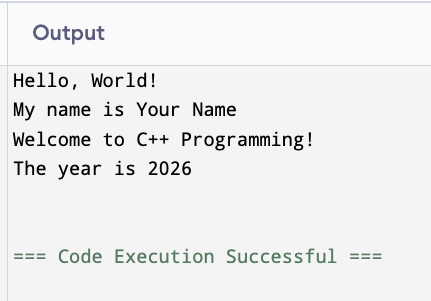

<!-- Topic 6: Coding Exercise 1-1 -->
<!-- Total slides: 4 -->

# Coding Exercise 1-1

---

## Your first C++ program {.smaller}

+ Type the program on the next slide exactly as shown — do not copy and paste.
+ Compile it, fix any errors, and run it until the output matches the expected result.

::: notes
Total slides: 4
Typing code by hand builds muscle memory and forces students to notice every character. Copy-paste hides errors and prevents learning. This is the first of many exercises this semester — set the expectation now that exercises are done, not watched.
:::

<!-- Slide 1 -->

---

## The task {.smaller}

+ Duplicate the following program.
+ Compile it successfully.
+ Run it and verify the output matches the expected result on the last slide.

::: notes
Keep the task statement simple. Students who overthink the instructions tend to not start. The goal is just to get a working program running. Errors along the way are expected and instructive.
:::

<!-- Slide 2 -->

---

## 1-1.cpp {.smaller}

```{.cpp}
// 1-1.cpp
// Your Name
// Today's Date
// My first C++ program.
#include <iostream>
using namespace std;

int main()
{
    string name = "Your Name";    // replace with your first and last name
    int year = 2026;              // replace with the current year

    cout << "Hello, World!" << endl;
    cout << "My name is " << name << endl;
    cout << "Welcome to C++ Programming!" << endl;
    cout << "The year is " << year << endl;

    return 0;
}
```

::: notes
Students replace "Your Name" with their actual name and update the year. The SFH is already partially filled in — they fill in their name and today's date. This exercise uses every concept from today's lecture: SFH, #include, using namespace std, main(), variables, cout, return 0.
:::

<!-- Slide 3 -->

---

## Expected output {.smaller}



::: notes
Students should match this output exactly (with their own name substituted). If the output differs, they have a bug to find. The most common errors on this exercise: missing semicolon, mismatched quotes, SFH not filled in, copy-paste whitespace issues.
:::

<!-- Slide 4 -->
