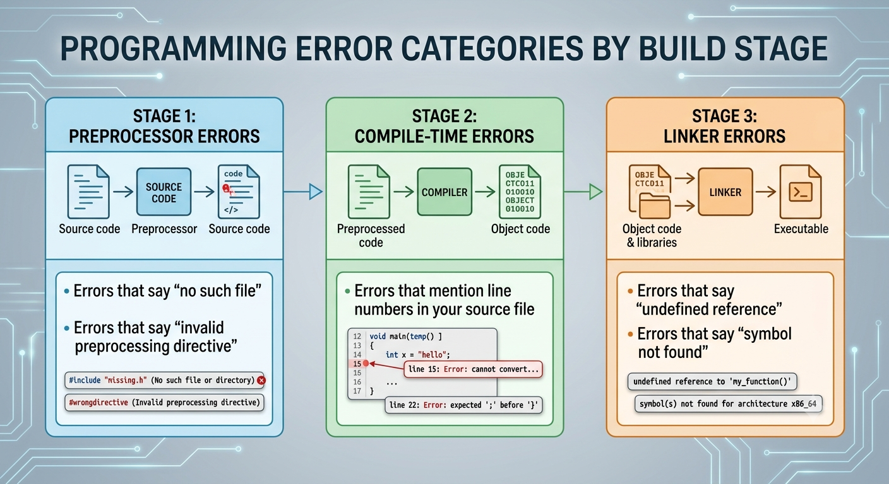

<!-- Topic 1: How the Compiler Works -->
<!-- Total slides: 16 -->

# How the Compiler Works

## What happens when you press "build"? {.smaller}

+ The compiler transforms your source code through several distinct stages into an executable program.
+ Understanding this process helps you read error messages, locate bugs faster, and write code that compiles cleanly.

::: notes
Total slides: 16
Frame this as practical knowledge, not theory. Every error message a student sees — "undeclared identifier," "undefined reference," "no matching function" — comes from one of the three stages. Knowing which stage produced the error tells you where to look.
:::

<!-- Slide 1 -->

---

## The three stages {.smaller}

+ **Stage 1 — Preprocessing:** resolves `#include`, `#define`, and macro directives before the compiler ever sees your code.
+ **Stage 2 — Compilation:** type-checks the source and translates it to object code.
+ **Stage 3 — Linking:** combines object files and resolves references to library functions.

::: {style="width: 80%; margin-left: 0; margin-right: auto;"}
```{.plantuml}
@startuml compilation_stages
skinparam backgroundColor #FFFFFF
skinparam defaultFontName "Helvetica Neue"
skinparam defaultFontSize 13
skinparam rectangle {
  BackgroundColor #2C3E50
  FontColor #ECEFF1
  BorderColor #1A252F
  BorderThickness 2
  RoundCorner 14
  FontSize 13
}
skinparam note {
  BackgroundColor #F2F3F4
  BorderColor #BDC3C7
  FontColor #2C3E50
  FontSize 11
}
skinparam arrow {
  Color #7F8C8D
  FontColor #5D6D7E
  FontSize 10
  Thickness 2
}
left to right direction
note as N0
  <b>main.cpp</b>
  <i>.h files</i>
end note
rectangle "<b>1 — Preprocessor</b>\n\n&#35;include, &#35;define\nmacro expansion" as P
note as N1
  <b>Expanded Source</b>
  <i>(.ii)</i>
end note
rectangle "<b>2 — Compiler</b>\n\nsyntax & type check\n→ object code" as C
note as N2
  <b>Object File</b>
  <i>(.o)</i>
end note
rectangle "<b>3 — Linker</b>\n\nresolve symbols\ncombine .o files" as L
note as N3
  <b>Executable</b>
end note
note as LIB
  Standard Library
  <i>(.a / .so)</i>
end note
N0 --> P
P --> N1
N1 --> C
C --> N2
N2 --> L
L --> N3
LIB -up-> L
@enduml
```
:::

::: notes
[Graphic suggestion: horizontal pipeline diagram — source → preprocessor → expanded source → compiler → object file → linker (+ library) → executable.]
:::

<!-- Slide 2 -->

---

## Stage 1: Preprocessing {.smaller}

+ Runs before compilation; processes all directives that start with `#`.
+ Expands `#include` by inserting the full contents of the header file verbatim.
+ Removes comments; output is still C++ source, not object code.

::: notes
Students sometimes think the preprocessor is part of the compiler — it is not. It is a separate text-processing step that knows nothing about C++ syntax. The preprocessor cannot catch type errors or undefined variables. It simply performs textual substitution.
:::

<!-- Slide 3 -->

---

## Preprocessing directives {.smaller}

+ `#include <file>` — inserts a header file's contents verbatim at that point in the source.
+ `#define NAME value` — textual substitution; every occurrence of NAME is replaced before compilation.
+ `#pragma once` — prevents a header from being inserted more than once per translation unit.

::: notes
Without pragma once (or header guards), including the same header twice from different files causes redeclaration errors at compile time. Students will see both pragma once and the classic #ifndef/#define/#endif pattern in code they read.
:::

<!-- Slide 4 -->

---

## Stage 2: Compilation {.smaller}

+ Takes preprocessed source and checks syntax and type correctness.
+ Translates valid C++ into processor-specific object code.
+ One `.cpp` file → one `.o` object file.

::: notes
This is the stage students interact with most — syntax errors and type errors both appear here. The compiler processes one .cpp file at a time; it has no knowledge of other .cpp files. Definitions are resolved at link time.
:::

<!-- Slide 5 -->

---

## What the compiler checks: syntax errors {.smaller}

+ **Syntax** — does your code follow C++ grammar rules? Missing braces, semicolons, or mismatched delimiters are caught here.

```{.cpp}
int main()
    cout << "hello";   // ERROR: missing { before function body
    return 0;
}
```

```
error: expected '{' before 'cout'
```

<!-- Slide 6 -->

---

## What the compiler checks: type errors {.smaller}

+ **Types** — do variable types match in assignments and operations? C++ is statically typed — mismatches are caught at compile time, not at runtime.

```{.cpp}
int age = 25;
age = "twenty-five";   // ERROR: can't store a string in an int
```

```
error: invalid conversion from 'const char*' to 'int'
```

<!-- Slide 7 -->

---

## Static typing — a C++ strength {.smaller}

::: {.columns}
::: {.column width="45%"}

:::
::: {.column width="55%"}
Static typing is a key C++ strength: an entire class of bugs that would appear only at runtime in Python or JavaScript are caught at compile time in C++.
:::
:::

<!-- Slide 15 -->

---

## What the compiler checks: scope and declaration errors {.smaller}

+ **Scope and declarations** — are all variables and functions declared before use? Do names conflict within the same scope?

```{.cpp}
int main()
{
    count = 10;   // ERROR: 'count' was never declared
    return 0;
}
```

```
error: 'count' was not declared in this scope
```

::: notes
Static typing is a key C++ strength: an entire class of bugs that would appear only at runtime in Python or JavaScript are caught at compile time in C++.
:::

<!-- Slide 8 -->

---

## Stage 3: Linking {.smaller}

+ Combines multiple `.o` object files into a single executable.
+ Resolves references to library functions (e.g., `cout` from `<iostream>`).
+ Reports "undefined reference" when a called function has no definition anywhere.

::: notes
The most common linker error beginners see: "undefined reference to 'main'" (forgot to write main) or "undefined reference to 'sqrt'" (forgot to link the math library). These are not compile errors — the code compiled fine; the linker just cannot find the implementation.
:::

<!-- Slide 9 -->

---

## What the compiler checks {.smaller}

+ **Syntax errors** — missing braces, semicolons, or mismatched delimiters.
+ **Type errors** — mismatched types in assignments or operations.
+ **Scope and declaration errors** — using identifiers that are undeclared or redeclared.

<!-- Slide 10 -->

---

## Translation units {.smaller}

+ Each `.cpp` file is compiled independently — it is called a **translation unit**.
+ The compiler sees one `.cpp` file at a time and has no knowledge of other `.cpp` files until linking.
+ Declarations go in `.h` files so the preprocessor can copy them into every `.cpp` that needs them.

```{.cpp}
// math.h — declaration only (shared via #include)
int add(int a, int b);

// math.cpp — definition in its own translation unit
int add(int a, int b) { return a + b; }

// main.cpp — sees the declaration via #include, not the definition
#include "math.h"
int main() { return add(2, 3); }
```

::: notes
This explains why a function defined in another .cpp causes an "undeclared" error: the compiler only sees the .cpp it is currently compiling. The declaration in the header gives the compiler what it needs for type checking; the linker handles connecting the call to the definition.
:::

<!-- Slide 11 -->

---

## Translation units — for your general knowledge {.smaller}

+ The concept of **translation units** is part of how C++ works under the hood.
+ You do not need to worry about this for this course.
+ You may come across the term in your readings or online — now you know what it means.

::: notes
This is a gentle landing after a fairly dense slide. Students at this level do not need to write multi-file programs yet. The goal of the translation unit slide was to explain why declarations go in headers; this slide releases the pressure and lets students know the concept is background knowledge, not something they will be tested on.
:::

<!-- Slide 12 -->

---

## Reading error messages by stage {.smaller}

+ Errors that mention **line numbers in your source file** → compile-time errors (Stage 2).
+ Errors that say **"undefined reference"** or **"symbol not found"** → linker errors (Stage 3).
+ Errors that say **"no such file"** or **"invalid preprocessing directive"** → preprocessor errors (Stage 1).

::: notes
Teaching students to categorize errors by stage is a practical debugging skill. A linker error means the code compiled correctly — the problem is a missing definition, not a syntax mistake.
:::

<!-- Slide 13 -->

---

## {.smaller}



<!-- Slide 14 -->

---


## Summary {.smaller}

+ The compiler transforms source code through preprocessing, compilation, and linking.
+ Understanding these stages helps you interpret error messages and locate bugs faster.
+ Compile errors → Stage 2. Linker errors → Stage 3. File-not-found → Stage 1.

<!-- Slide 16 -->
