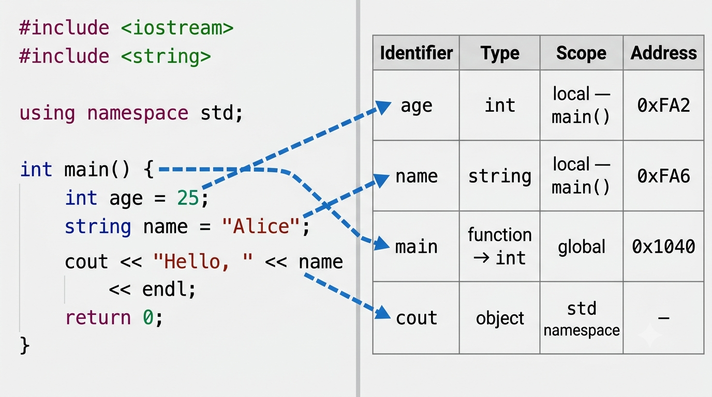

<!-- Topic 2: The Symbol Table -->
<!-- Slides 21–27 -->

# The Symbol Table
<!-- Slide 20 -->

## What problems does the compiler face tracking every identifier? {.smaller}

+ The symbol table is the compiler's internal database that records every identifier — variable, function, or type — along with its name, type, scope, and location.
+ Every type mismatch, undeclared variable, and redeclaration error traces back to this table.

::: notes
Slides 21–27
Frame this as the mechanism behind error messages students already encounter. "Undeclared identifier" means: the compiler searched the symbol table and found no entry. "Redeclaration" means: the compiler found an entry already. Once students understand the table, the error messages make sense.
:::

<!-- Slide 21 -->

---

## What goes in the symbol table? {.smaller}



::: notes
Two-panel diagram: source code on the left, symbol table entries on the right with arrows connecting each identifier to its row. Name, type, scope, and address are the four fields. This image replaces the text description — the visual makes the mapping between code and table entries concrete.
:::

<!-- Slide 22 -->

---

## How the compiler uses it {.smaller}

+ **Type checking** — when you write `int x = "hello"`, the compiler looks up `x` in the table, sees `int`, and rejects the string.
+ **Scope resolution** — when you reference `count`, the compiler searches from the innermost scope outward.
+ **Duplicate detection** — if you declare the same name twice in the same scope, the compiler finds the first entry and rejects the second.
+ **Code generation** — addresses stored in the table tell the compiler where to read and write each variable.

<!-- Slide 23 -->

---

## Undeclared identifier error {.smaller}

```{.cpp}
int main()
{
    count = 10;   // error: 'count' was not declared in this scope
    return 0;
}
```

::: notes
The compiler searched the symbol table — starting in main()'s scope, then global scope — and found no entry for 'count'. The fix is always the same: declare the variable before you use it. The error message tells students exactly what went wrong and where to look.
:::

<!-- Slide 24 -->

---

## Redeclaration error {.smaller}

```{.cpp}
int main()
{
    int x = 5;
    int x = 10;   // error: redeclaration of 'int x'
    return 0;
}
```

::: notes
The compiler found 'x' already in the symbol table for this scope and cannot add a second entry with the same name. Each identifier can have only one entry per scope. The solution: either rename the second variable or remove the redundant declaration.
:::

<!-- Slide 25 -->

---

## Type mismatch error {.smaller}

```{.cpp}
int main()
{
    int age = 25;
    age = "twenty-five";  // error: invalid conversion from 'const char*' to 'int'
    return 0;
}
```

::: notes
The symbol table records 'age' as type int. When the compiler evaluates the assignment, it checks the incoming value's type (const char*) against the table entry (int) and rejects it. This is static type checking at work.
:::

<!-- Slide 26 -->

---

## Summary {.smaller}

+ The symbol table records every identifier: name, type, scope, and address.
+ Type mismatches, undeclared variables, and redeclarations all stem from symbol table violations.
+ Understanding the table turns cryptic compiler error messages into actionable information.

<!-- Slide 27 -->
