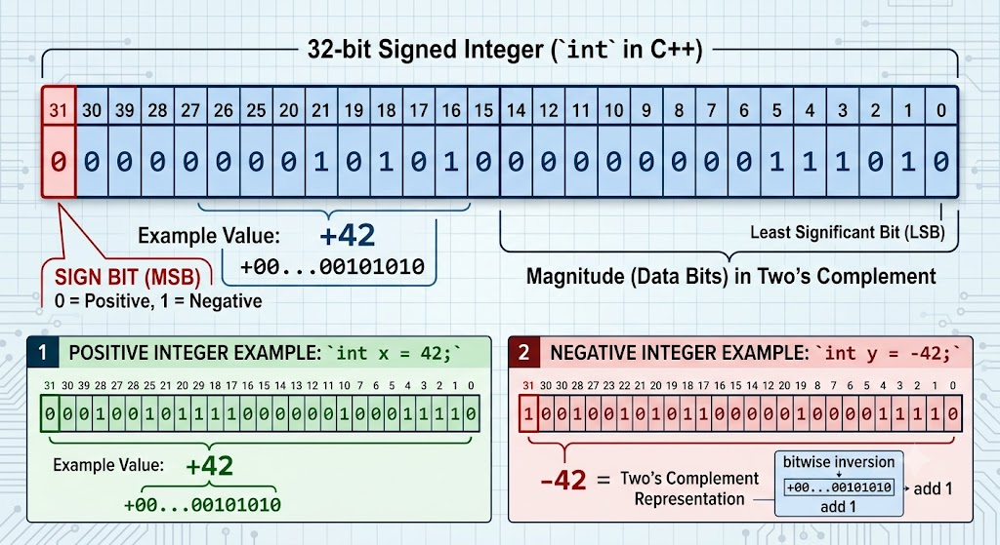

<!-- Topic 5: Signed vs Unsigned Variables -->
<!-- Total slides: 10 -->

# Signed vs Unsigned Variables

## How does a variable store negative numbers? {.smaller}

+ The difference between signed and unsigned is not just range — it affects overflow behavior, comparison logic, and compatibility with standard library types.
+ Most bugs in this area appear silently — no compile error, wrong answer.

::: notes
Total slides: 10
Connect to the overflow topic: students now know unsigned overflow wraps and signed overflow is undefined. This section explains why — it is in the bit representation. The mixing-types trap is the most practically important part.
:::

<!-- Slide 1 -->

---

## Signed: the MSB is the sign bit {.smaller}

+ A signed integer uses the most significant bit (MSB) as a **sign bit**.
+ In **two's complement** — the format used on all modern hardware — a 1 in the MSB means negative, 0 means non-negative.
+ A 32-bit signed `int` uses 31 bits for magnitude and 1 bit for sign.

::: notes
[Graphic suggestion: 32-bit layout diagram showing bit 31 labeled "sign bit" and bits 0–30 labeled "magnitude."]
Two's complement makes addition work without special-casing negative numbers — the hardware uses the same addition circuit for both. Students do not need to understand two's complement arithmetic in detail, but they should know the MSB encodes sign.
:::

<!-- Slide 2 -->

---

## {.smaller}

{width=52%}

<!-- Slide 3 -->

---

## Unsigned: all bits for magnitude {.smaller}

+ An unsigned variable has no sign bit — all bits represent magnitude.
+ A 32-bit `unsigned int` uses all 32 bits, doubling the positive range.

| Type | Minimum | Maximum |
|------|---------|---------|
| `int` (signed) | −2,147,483,648 | +2,147,483,647 |
| `unsigned int` | 0 | +4,294,967,295 |
| `short` (signed) | −32,768 | +32,767 |
| `unsigned short` | 0 | +65,535 |

<!-- Slide 4 -->

---

## When to use unsigned {.smaller}

+ Use unsigned when the value can never be negative: sizes, counts, array indexes.
+ Use unsigned for bit manipulation: flags, masks, bitwise operations.
+ Use `size_t` (unsigned) when matching the return type of `.size()` on containers.

```{.cpp}
for (size_t i = 0; i < vec.size(); ++i) {
    // size_t matches vec.size() type — no sign-comparison warning
}
```

<!-- Slide 5 -->

---

## When to use signed {.smaller}

+ Use signed for all general arithmetic unless there is a specific reason for unsigned.
+ Signed is the default for `int`, `short`, and `long`.
+ If a variable can ever be negative — even theoretically — use signed.

```{.cpp}
int temperature = -15;   // can be negative
int balance     = -200;  // account overdraft
int velocity    = -50;   // moving in reverse
```

<!-- Slide 6 -->

---

## Mixing signed and unsigned — the trap {.smaller}

+ When a signed and unsigned value appear in the same expression, the signed value is **implicitly converted to unsigned**.
+ A negative signed value becomes a very large positive unsigned value.

```{.cpp}
int          s =  -5;
unsigned int u =  10;

if (s < u) {
    cout << "s < u\n";      // looks like it should print...
} else {
    cout << "NOT s < u\n";  // ...but this prints instead
}
```

::: notes
-5 is converted to unsigned int: it becomes 4,294,967,291. The comparison 4294967291 < 10 is false. This is a real source of security bugs in C++ — bounds checks that silently invert. Enable -Wsign-compare in g++ to catch this at compile time. The fix: use a consistent type throughout, or cast explicitly.
:::

<!-- Slide 7 -->

---

## Overflow behavior differs {.smaller}

```{.cpp}
int s = INT_MAX;
s++;              // undefined behavior — signed overflow

unsigned int u = UINT_MAX;
u++;              // well-defined: wraps to 0
```

::: notes
Revisit the overflow topic here in the signed/unsigned context. The behavior difference is fundamental: it comes from the language standard, not from hardware. Signed overflow being undefined is intentional — it lets the compiler assume it never happens and optimize aggressively.
:::

<!-- Slide 8 -->

---

## Enabling sign-comparison warnings {.smaller}

+ The compiler can warn you when signed and unsigned values are compared.
+ Add `-Wsign-compare` to your build flags (included in `-Wall`).

```
g++ -Wall -Wextra myprogram.cpp
```

```
warning: comparison of integer expressions of different signedness:
'int' and 'unsigned int' [-Wsign-compare]
```

::: notes
-Wall enables most common warnings including -Wsign-compare. Students should compile with -Wall from the start — it catches a wide class of common mistakes. The goal is zero warnings, not just zero errors.
:::

<!-- Slide 9 -->

---

## Summary {.smaller}

+ Signed is the safe default for general arithmetic; unsigned is appropriate for sizes, indexes, and bit operations.
+ Mixing the two in comparisons or arithmetic silently converts signed to unsigned — a common source of logic bugs.
+ Enable `-Wall` and address sign-comparison warnings rather than casting them away.

<!-- Slide 10 -->
