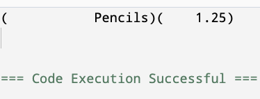

<!-- Topic 3: Output Manipulators -->
<!-- Slides 24-38 -->

# Output Manipulators
<!-- Slide 24 -->

## Controlling the Shape of Output {.smaller}

+ How do we make numeric output readable instead of merely correct?
+ Manipulators let `cout` control spacing, alignment, and decimal precision.


::: notes
Slides 24-38
:::

<!-- Slide 25 -->

---

## The iomanip Header

Many output manipulators live in `<iomanip>`.

```cpp
#include <iostream>
#include <iomanip>
using namespace std;
```

Use this header when output needs columns, alignment, or fixed decimal places.

<!-- Slide 26 -->

---

## setw

`setw(n)` sets the width for the next item only.

```cpp
cout << setw(10) << "Item"
     << setw(8) << "Price" << endl;
```

The next value is padded with spaces if it is shorter than the requested width.

<!-- Slide 27 -->

---

## Alignment

`left` and `right` control how values sit inside a field.

```cpp
cout << left  << setw(12) << "Pencils"
     << right << setw(8)  << 1.25 << endl;
```

Labels often read best left-aligned; numbers often read best right-aligned.

<!-- Slide 28 -->

---

## Manipulators for Today

+ `setw(n)` sets the width for the next printed item.
+ `left` and `right` control alignment inside a field.
+ `fixed` switches decimal output to fixed-point notation.
+ `setprecision(n)` controls the number of digits after the decimal when used with `fixed`.

<!-- Slide 29 -->

---

## Alignment Output

Periods show the spaces that the terminal normally leaves blank.

```text
Pencils.........1.25
```

`left` pads after the label; `right` pads before the number.

<!-- Slide 30 -->

---

## fixed and setprecision

`fixed` prints floating-point values with a fixed number of digits after the decimal.

```cpp
double total = 18.5;

cout << fixed << setprecision(2);
cout << "Total: $" << total << endl;
```

This prints money-like values with two decimal places.

<!-- Slide 31 -->

---

## fixed and setprecision Output



<!-- Slide 32 -->

---

## Sticky and One-Time Settings

+ `setw(n)` affects only the next printed item.
+ `fixed`, `setprecision(n)`, `left`, and `right` stay active until changed.

```cpp
cout << fixed << setprecision(2);
cout << setw(8) << 3.5 << endl;
cout << setw(8) << 12.75 << endl;
```

<!-- Slide 33 -->

---

## Sticky Settings Output

The width is applied separately to each value.

```text
....3.50
...12.75
```

Periods show the spaces added by each `setw(8)` call.

<!-- Slide 34 -->

---

## Complete Example

```cpp
#include <iostream>
#include <iomanip>
using namespace std;

int main() {
    cout << fixed << setprecision(2);

    cout << left << setw(12) << "Item"
         << right << setw(8) << "Price" << endl;

    cout << left << setw(12) << "Notebook"
         << right << setw(8) << 4.99 << endl;

    return 0;
}
```

<!-- Slide 35 -->

---

## Complete Example Output

```text
Item..........Price
Notebook......4.99
```

Periods show padding spaces. In the actual terminal, those positions are blank.

<!-- Slide 36 -->

---

## Summary

+ Use `<iomanip>` when output needs formatting.
+ `setw` creates columns; `fixed` and `setprecision` control decimals.
+ Formatting is part of program communication.

<!-- Slide 37 -->

---

## Other Useful Manipulators

+ `setfill(ch)` changes the padding character used by `setw`.
+ `boolalpha` prints Boolean values as `true` or `false` instead of `1` or `0`.
+ `showpoint` forces a decimal point to appear for floating-point values.
+ `scientific` prints floating-point values in scientific notation.
+ `hex`, `dec`, and `oct` switch integer output between base 16, base 10, and base 8.

<!-- Slide 38 -->
