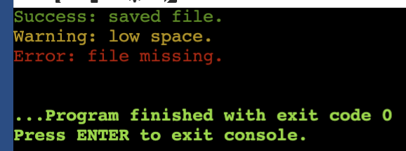

<!-- Topic 4: Terminal Color Codes -->
<!-- Slides 39-49 -->

# Terminal Color Codes
<!-- Slide 39 -->

## Output With Emphasis {.smaller}

+ How can a terminal program make important messages stand out?
+ ANSI escape codes can change text color in many modern terminals.


::: notes
Slides 39-49
:::

<!-- Slide 40 -->

---

## ANSI Escape Codes

An ANSI escape code is a short string that tells the terminal to change how text is displayed.

```cpp
"\033[031m"
```

This code switches the following terminal text to red.

<!-- Slide 41 -->

---

## Color Code Pattern

Most simple foreground color codes follow this shape.

```text
\033[COLORm
```

+ `\033` is the escape character.
+ `[` starts the control sequence.
+ `COLOR` is the numeric color code.
+ `m` ends the sequence.

<!-- Slide 42 -->

---

## Common Foreground Colors

::: {.columns}
::: {.column width="50%"}
+ `\033[030m` black
+ `\033[031m` red
+ `\033[032m` green
+ `\033[033m` yellow
:::

::: {.column width="50%"}
+ `\033[034m` blue
+ `\033[035m` magenta
+ `\033[036m` cyan
+ `\033[037m` white
:::
:::

<!-- Slide 43 -->

---

## Always Reset

The reset code returns the terminal to normal output.

```cpp
const string NORM = "\033[0m";
```

If you do not reset, later output may keep the previous color.

<!-- Slide 44 -->

---

## Store Colors as Constants

Named constants make color output readable.

```cpp
const string RED = "\033[031m";
const string GREEN = "\033[032m";
const string YELLOW = "\033[033m";
const string BLUE = "\033[034m";
const string NORM = "\033[0m";
```

The name explains the purpose better than the number alone.

<!-- Slide 45 -->

---

## Meaningful Colors

Use color to reinforce meaning, not to decorate every line.

+ Red: error or important warning.
+ Yellow: caution.
+ Green: success.
+ Blue: information.

<!-- Slide 46 -->

---

## Complete Example

```cpp
#include <iostream>
#include <string>
using namespace std;

int main() {
    const string RED = "\033[031m";
    const string GREEN = "\033[032m";
    const string YELLOW = "\033[033m";
    const string NORM = "\033[0m";

    cout << GREEN << "Success: saved file." << NORM << endl;
    cout << YELLOW << "Warning: low space." << NORM << endl;
    cout << RED << "Error: file missing." << NORM << endl;

    return 0;
}
```

<!-- Slide 47 -->

---

## Terminal Color Output



<!-- Slide 48 -->

---

## Summary

+ ANSI escape codes can color terminal text.
+ Store codes as named constants.
+ Always reset with `NORM` after colored output.

<!-- Slide 49 -->
