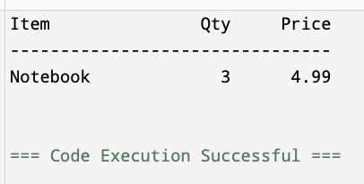

<!-- Topic 5: Table Architectures -->
<!-- Slides 50-58 -->

# Table Architectures
<!-- Slide 50 -->

## Terminal Color Output


::: notes
Slides 50-58
:::

<!-- Slide 51 -->

---

## What Makes a Table

+ A title tells the reader what the data represents.
+ Headings name each column.
+ Rows repeat the same column order.
+ Width and alignment keep the structure visible.

<!-- Slide 52 -->

---

## Choose Column Widths

Pick widths based on the longest expected item.

```cpp
cout << left << setw(14) << "Item"
     << right << setw(8) << "Qty"
     << right << setw(10) << "Price" << endl;
```

Start with slightly generous widths and adjust after seeing real output.

<!-- Slide 53 -->

---

## Align by Data Type

+ Text columns usually read best left-aligned.
+ Numeric columns usually read best right-aligned.
+ Decimal values should use consistent precision.

```cpp
cout << fixed << setprecision(2);
```

<!-- Slide 54 -->

---

## Header and Rows

The header and each row should use the same widths.

```cpp
cout << left << setw(14) << "Item"
     << right << setw(8) << "Qty"
     << setw(10) << "Price" << endl;

cout << left << setw(14) << "Notebook"
     << right << setw(8) << 3
     << setw(10) << 4.99 << endl;
```

<!-- Slide 55 -->

---

## Separator Lines

A separator gives the eye a boundary between headings and data.

```cpp
cout << "--------------------------------" << endl;
```

Keep separator length close to the total table width.

<!-- Slide 56 -->

---

## Complete Example

```cpp
#include <iostream>
#include <iomanip>
using namespace std;

int main() {
    cout << fixed << setprecision(2);

    cout << left << setw(14) << "Item"
         << right << setw(8) << "Qty"
         << setw(10) << "Price" << endl;
    cout << "--------------------------------" << endl;
    cout << left << setw(14) << "Notebook"
         << right << setw(8) << 3
         << setw(10) << 4.99 << endl;

    return 0;
}
```

<!-- Slide 57 -->

---

## Complete Example - Output



---

## Summary

+ Tables are built from repeated output patterns.
+ Use consistent widths, alignment, and decimal formatting.
+ The goal is output a person can scan quickly.

<!-- Slide 58 -->

---
