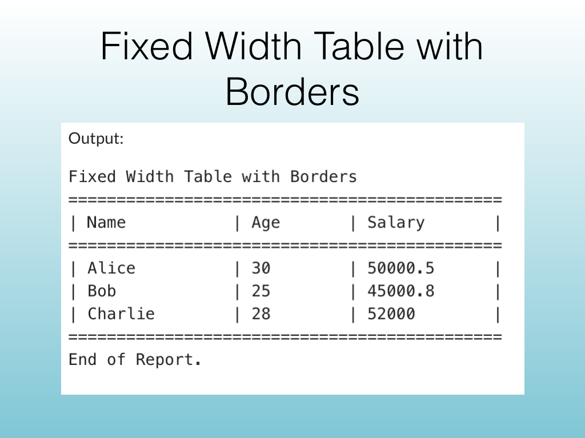
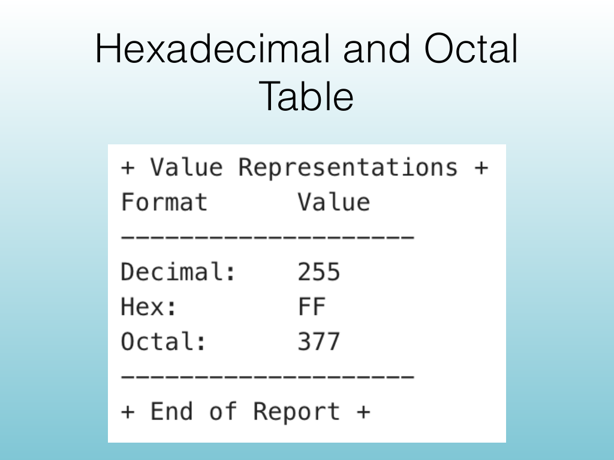
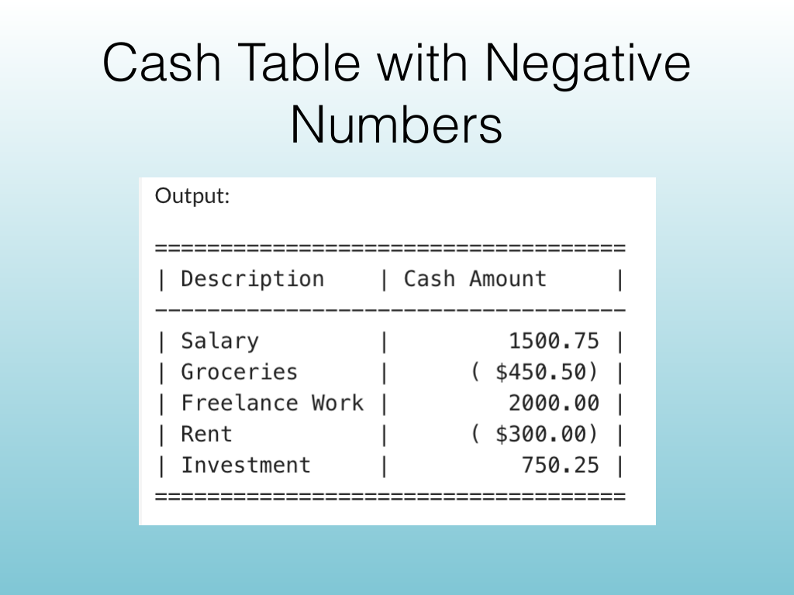
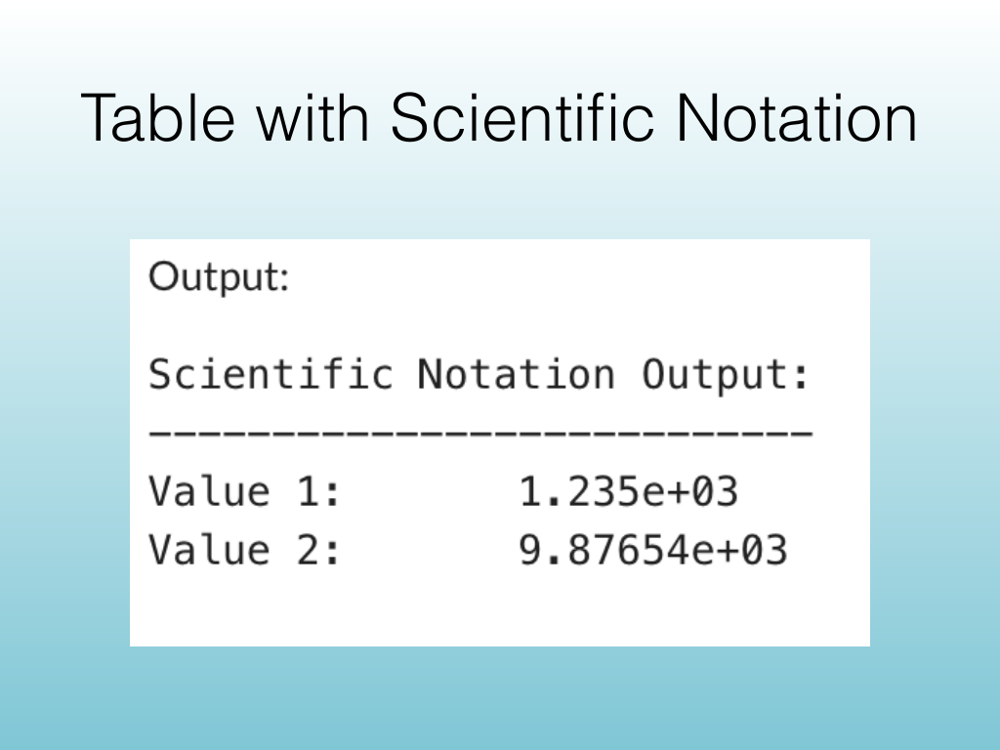
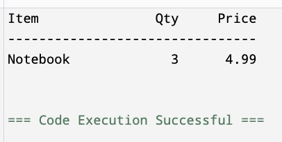

<!-- Topic 5: Table Architectures -->
<!-- Slides 50-68 -->

# Table Architectures
<!-- Slide 50 -->

## Output Students Can Scan {.smaller}

+ How do we turn several related values into a readable report?
+ A table uses repeated formatting rules so rows line up.


::: notes
Slides 50-68
:::

<!-- Slide 51 -->

---

## What Makes a Table

+ A title tells the reader what the data represents.
+ Headings name each column.
+ Rows repeat the same column order.
+ Width and alignment keep the structure visible.

<!-- Slide 52 -->

---

## Choose Column Widths

Pick widths based on the longest expected item.

```cpp
cout << left << setw(14) << "Item"
     << right << setw(8) << "Qty"
     << right << setw(10) << "Price" << endl;
```

Start with slightly generous widths and adjust after seeing real output.

<!-- Slide 53 -->

---

## Align by Data Type

+ Text columns usually read best left-aligned.
+ Numeric columns usually read best right-aligned.
+ Decimal values should use consistent precision.

```cpp
cout << fixed << setprecision(2);
```

<!-- Slide 54 -->

---

## Header and Rows

The header and each row should use the same widths.

```cpp
cout << left << setw(14) << "Item"
     << right << setw(8) << "Qty"
     << setw(10) << "Price" << endl;

cout << left << setw(14) << "Notebook"
     << right << setw(8) << 3
     << setw(10) << 4.99 << endl;
```

<!-- Slide 55 -->

---

## Separator Lines

A separator gives the eye a boundary between headings and data.

```cpp
cout << "--------------------------------" << endl;
```

Keep separator length close to the total table width.

<!-- Slide 56 -->

---

## Choose the Table Architecture

The data inside the table drives the decision about which table to use.

+ Fixed-width borders emphasize row and column boundaries.
+ Hexadecimal and octal tables compare value representations.
+ Cash tables need aligned signs and decimal places.
+ Scientific notation tables need room for exponents.

<!-- Slide 57 -->

---

## Fixed-Width Table with Borders

Borders and repeated widths make each record easy to scan.



<!-- Slide 58 -->

---

## Coding a Fixed-Width Table

Use the same width and alignment settings for the heading, separator, and every row.

```cpp
cout << left << setw(12) << "Name"
     << right << setw(6) << "Age"
     << setw(10) << "Salary" << endl;
cout << "============================" << endl;
cout << left << setw(12) << "Alice"
     << right << setw(6) << 30
     << setw(10) << 50000.50 << endl;
```

<!-- Slide 59 -->

---

## Hexadecimal and Octal Table

The same value can be displayed in several representations when the format column names the representation.



<!-- Slide 60 -->

---

## Coding a Hexadecimal and Octal Table

Set the base before printing the value, then restore `dec` before printing ordinary numbers or labels.

```cpp
int value = 255;

cout << left << setw(12) << "Format"
     << right << setw(8) << "Value" << endl;
cout << left << setw(12) << "Decimal"
     << right << setw(8) << dec << value << endl;
cout << left << setw(12) << "Hex"
     << right << setw(8) << hex << value << endl;
cout << left << setw(12) << "Octal"
     << right << setw(8) << oct << value << dec << endl;
```

<!-- Slide 61 -->

---

## Cash Table with Negative Numbers

Currency output needs consistent decimal precision and enough width for a negative sign and parentheses.



<!-- Slide 62 -->

---

## Coding a Cash Table with Negative Numbers

Use `fixed` and `setprecision(2)` so positive and negative amounts share the same decimal format.

```cpp
cout << left << setw(18) << "Description"
     << right << setw(12) << "Cash Amount" << endl;
cout << fixed << setprecision(2);
cout << left << setw(18) << "Salary"
     << right << setw(12) << 1500.75 << endl;
cout << left << setw(18) << "Groceries"
     << right << setw(12) << -450.50 << endl;
```

<!-- Slide 63 -->

---

## Scientific Notation Table

Scientific notation keeps very large or very small values readable while preserving a compact table width.



<!-- Slide 64 -->

---

## Coding a Scientific Notation Table

Use `scientific` when the magnitude of the values matters more than writing every zero.

```cpp
cout << left << setw(12) << "Value"
     << right << setw(16) << "Scientific" << endl;
cout << scientific << setprecision(3);
cout << left << setw(12) << "Value 1"
     << right << setw(16) << 1.235e3 << endl;
cout << left << setw(12) << "Value 2"
     << right << setw(16) << 9.87654e3 << endl;
```

<!-- Slide 65 -->

---

## Complete Example

```cpp
#include <iostream>
#include <iomanip>
using namespace std;

int main() {
    cout << fixed << setprecision(2);

    cout << left << setw(14) << "Item"
         << right << setw(8) << "Qty"
         << setw(10) << "Price" << endl;
    cout << "--------------------------------" << endl;
    cout << left << setw(14) << "Notebook"
         << right << setw(8) << 3
         << setw(10) << 4.99 << endl;

    return 0;
}
```

<!-- Slide 66 -->

---

## Complete Example - Output



<!-- Slide 67 -->

---

## Summary

+ Tables are built from repeated output patterns.
+ Use consistent widths, alignment, and decimal formatting.
+ The goal is output a person can scan quickly.

<!-- Slide 68 -->
