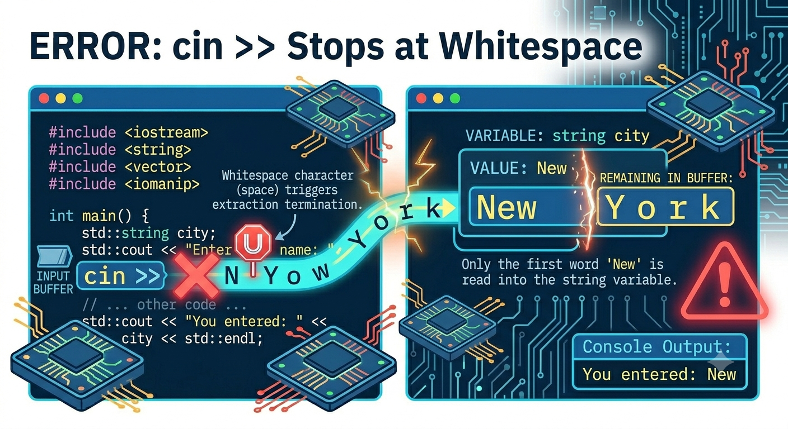
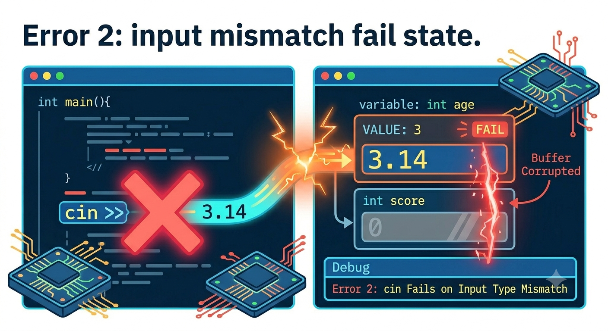

<!-- Topic 1: Advanced cin -->
<!-- Slides 3-15 -->

# Advanced cin
<!-- Slide 3 -->

## Input Beyond One Word {.smaller}

+ What happens when user input is messier than the example?
+ `cin` is predictable, but we need to know what it consumes and what it leaves behind.

::: notes
Slides 3-15
:::

<!-- Slide 4 -->

---

## Two Input Problems

+ `cin >>` stops when it reaches whitespace.
+ `cin` fails when the input does not match the receiving variable's type.

These are different problems with different fixes.

<!-- Slide 5 -->

---

## Whitespace Stops Extraction

`cin >>` reads one token at a time.

```cpp
string fullName;

cout << "Full name: ";
cin >> fullName;
```

If the user types `Maya Chen`, only `Maya` is stored.

<!-- Slide 6 -->

---

## Whitespace Output



<!-- Slide 7 -->

---

## getline Reads the Whole Line

`getline(cin, variable)` reads through the end of the line.

```cpp
string fullName;

cout << "Full name: ";
getline(cin, fullName);
```

Use `getline` when spaces are part of the input.

<!-- Slide 8 -->

---

## cin and getline Conflict

`cin >>` often leaves the newline character behind.

```cpp
int age;
string name;

cin >> age;
getline(cin, name);
```

The `getline` may read the leftover newline instead of waiting for a name.

<!-- Slide 9 -->

---

## cin.ignore Clears the Line

Use `cin.ignore()` after `cin >>` when the next read is `getline`.

```cpp
int age;
string name;

cin >> age;
cin.ignore();
getline(cin, name);
```

The ignored newline is removed before the full-line read.

<!-- Slide 10 -->

---

## Wrong Data Type

If the user types text when the program expects a number, extraction fails.

```cpp
int age;

cout << "Age: ";
cin >> age;
```

Typing `ten` does not produce an integer.

<!-- Slide 11 -->

---

## Mismatch Output



<!-- Slide 12 -->

---

## Clearing a Failed Read

After a failed read, clear the failure and remove the bad input.

```cpp
cin.clear();
cin.ignore(1000, '\n');
```

`clear` resets the stream state; `ignore` discards the leftover characters.

<!-- Slide 13 -->

---

## Common Practices

+ Use `cin >>` for one-word or one-number input.
+ Use `getline` when spaces are meaningful.
+ After failed numeric input, clear the stream before reading again.

<!-- Slide 14 -->

---

## Summary

+ Whitespace is a separator for `cin >>`.
+ Wrong data types put `cin` into a failed state.
+ Good input handling means knowing what remains in the input stream.

<!-- Slide 15 -->
