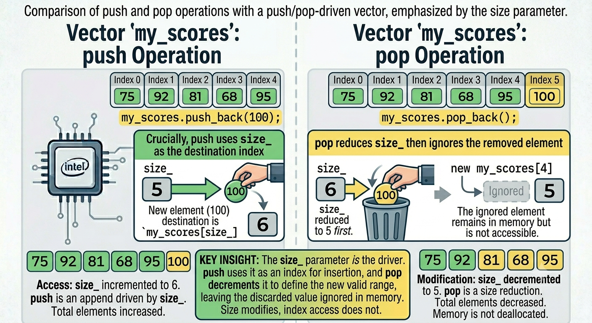
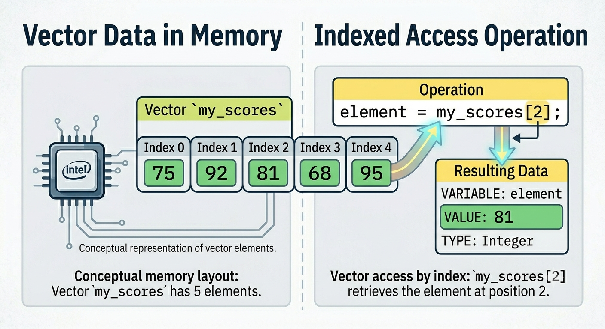

<!-- Topic 5: Choosing Access Style -->
<!-- Slides 51-60 -->

# Choosing Access Style
<!-- Slide 51 -->

## Two Ways to Reach a Value {.smaller}

+ Should the program use one known position or every value?
+ The answer chooses the access style.

::: notes
Slides 51-60
:::

<!-- Slide 52 -->

---

## Use Range-Based For

Use range-based `for` when the program should read every value.

```cpp
for (int score : scores) {
    cout << score << endl;
}
```

The loop handles each value in order.

<!-- Slide 53 -->

---

## Vector Access Picture

{.r-stretch}

<!-- Slide 54 -->

---

## Use Index Notation

Use index notation when the program needs one known position.

```cpp
cout << scores[0] << endl;
```

This reads the first value only.

<!-- Slide 55 -->

---

## Index Access Picture

{.r-stretch}

<!-- Slide 56 -->

---

## Decision Table

| Need | Use |
|---|---|
| every value | range-based `for` |
| one known position | index notation |
| position number matters | index notation later, with index-based loops |

For now, range-based `for` is the main tool for whole-vector processing.

<!-- Slide 57 -->

---

## Example: First and All

```cpp
vector<int> scores = {88, 92, 75};

cout << "First score: " << scores[0] << endl;

for (int score : scores) {
    cout << score << endl;
}
```

The first line uses a known position; the loop reads every value.

<!-- Slide 58 -->

---

## Common Practices

+ Prefer range-based `for` when position does not matter.
+ Use index notation only when the position is part of the problem.
+ Do not guess an index without knowing the vector has that position.

<!-- Slide 59 -->

---

## Summary

+ Vectors store ordered groups of values.
+ Operations change or inspect the vector.
+ Index notation reaches one position; range-based `for` visits every value.

<!-- Slide 60 -->
