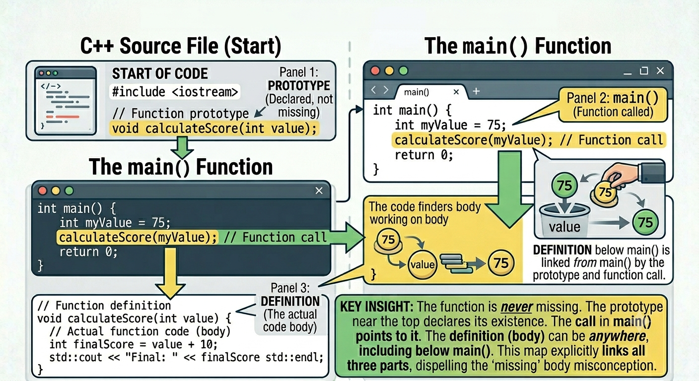

<!-- Topic 2: Coding Functions -->
<!-- Slides 15-26 -->

# Coding Functions
<!-- Slide 15 -->

## Where Does a Function Live? {.smaller}

+ A function has a prototype, a call, and a definition.
+ The prototype appears above `main()`.
+ The definition usually appears below `main()`.

::: notes
Slides 15-26
[Graphic suggestion: show a vertical code map with prototype near the top, main in the middle, and function definition below.]
:::

<!-- Slide 16 -->

---

## Smallest Useful Function

```cpp
#include <iostream>
using namespace std;

void displayMessage();      // Function Prototype

int main() {
    displayMessage();       // Function Call
    return 0;
}

void displayMessage() {     // Function Definition
    cout << "Hello from a function!" << endl;
}
```

<!-- Slide 17 -->

---

## Function Prototype

```cpp
#include <iostream>
using namespace std;

// Function Prototypes
void displayMessage();
```

+ The prototype tells the compiler the function exists.
+ It gives the return type, function name, and parameter list.
+ The semicolon marks this as a declaration, not the function body.

<!-- Slide 18 -->

---

## Function Definition

```cpp
return 0;
}       // main()

void displayMessage() {
    cout << "Hello from a function!" << endl;
}
```

+ The definition contains the function body.
+ This is the code that runs when the function is called.

<!-- Slide 19 -->

---

## Function Call

```cpp
displayMessage();
```

+ The function call transfers control to the function.
+ When the function finishes, execution returns to the next line.

<!-- Slide 20 -->

---

## Function Call Overview

{width="72%"}

<!-- Slide 21 -->

---

## Call Order

```cpp
int main() {
    cout << "Before" << endl;
    displayMessage();
    cout << "After" << endl;
    return 0;
}
```

+ `Before` prints first.
+ The function runs next.
+ `After` prints when control returns to `main()`.

<!-- Slide 22 -->

---

## Functions Calling Functions

```cpp
void deeper();
void deep();

void deep() {
    cout << "Inside deep()" << endl;
    deeper();
}

void deeper() {
    cout << "Inside deeper()" << endl;
}
```

A function can call another function.

<!-- Slide 23 -->

---

## Multiple Function Calls on the Stack

```{=html}
<div class="stack-demo" id="multi-stack-demo">
  <div class="stack-controls">
    <button onclick="multiStackStep(0)">1. main</button>
    <button onclick="multiStackStep(1)">2. deep</button>
    <button onclick="multiStackStep(2)">3. deeper</button>
    <button onclick="multiStackStep(3)">4. return to deep</button>
    <button onclick="multiStackStep(4)">5. return to main</button>
  </div>
  <div class="stack-area">
    <div class="stack-label">Call stack</div>
    <div class="stack-frame frame-main">main()</div>
    <div class="stack-frame frame-helper" id="multi-deep">deep()</div>
    <div class="stack-frame frame-helper" id="multi-deeper">deeper()</div>
  </div>
  <p id="multi-stack-caption">main() starts the call chain.</p>
</div>

<script>
function multiStackStep(step) {
  const deep = document.getElementById("multi-deep");
  const deeper = document.getElementById("multi-deeper");
  const caption = document.getElementById("multi-stack-caption");
  deep.style.display = step >= 1 && step <= 3 ? "block" : "none";
  deeper.style.display = step >= 2 && step <= 2 ? "block" : "none";
  caption.textContent = [
    "main() is active.",
    "main() calls deep(), so deep() is placed on top.",
    "deep() calls deeper(), so deeper() is placed on top.",
    "deeper() finishes first, and control returns to deep().",
    "deep() finishes, and control returns to main()."
  ][step];
}
</script>
```

::: notes
[Graphic suggestion: emphasize last-in, first-out order. The most recent function call returns first.]
:::

<!-- Slide 24 -->

---

## No Nested Function Definitions

```cpp
void outer() {
    void inner() {          // not allowed in C++
        cout << "Nope";
    }
}
```

+ C++ functions can call other functions.
+ C++ functions cannot be defined inside other functions.

<!-- Slide 25 -->

---

## Summary

+ A prototype declares the function before it is called.
+ A call runs the function.
+ A definition contains the function body.

<!-- Slide 26 -->
