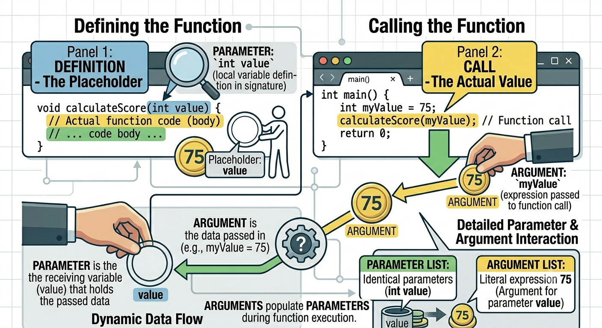

<!-- Topic 3: Passing Data to a Function -->
<!-- Slides 27-38 -->

# Passing Data to a Function
<!-- Slide 27 -->

## Functions Need Inputs {.smaller}

+ A fixed function works only for one situation.
+ A flexible function receives data from the caller.
+ Parameters let one function work with different values.

::: notes
Slides 27-38
:::

<!-- Slide 28 -->

---

## Parameters Receive Data

```cpp
void greet(string person) {
    cout << "Hello, " << person << "!" << endl;
}
```

+ `person` is a parameter.
+ It is a variable that belongs to the function.
+ It receives data when the function is called.

<!-- Slide 29 -->

---

## Arguments Provide Data

```cpp
greet("Maya");
```

+ `"Maya"` is an argument.
+ An argument is the actual value supplied by the caller.
+ The argument is copied into the parameter.

<!-- Slide 30 -->

---

## Arguments vs Parameters

{width="76%"}

<!-- Slide 31 -->

---

## Argument to Parameter

```cpp
void greet(string person) {
    cout << "Hello, " << person << "!" << endl;
}

int main() {
    greet("Maya");
    return 0;
}
```

The call sends `"Maya"` into the function, where `person` stores the copy.

<!-- Slide 32 -->

---

## One Parameter

```cpp
#include <iostream>
#include <string>
using namespace std;

void greet(string person);

int main() {
    greet("Maya");
    greet("Ari");
    greet("Chen");
    return 0;
}

void greet(string person) {
    cout << "Welcome, " << person << "!" << endl;
}
```

One function can handle many different values.

<!-- Slide 33 -->

---

## Multiple Parameters

```cpp
#include <iostream>
#include <string>
using namespace std;

void displayProduct(string name, double price);

int main() {
    displayProduct("Notebook", 4.99);
    displayProduct("Backpack", 39.95);
    return 0;
}

void displayProduct(string name, double price) {
    cout << name << " costs $" << price << endl;
}
```

Separate parameters with commas.

<!-- Slide 34 -->

---

## Order Matters

```cpp
void displayStudent(string name, int age) {
    cout << name << " is " << age << endl;
}

displayStudent("Maya", 20);  // correct
displayStudent(20, "Maya");  // wrong order
```

Arguments match parameters by position.

<!-- Slide 35 -->

---

## Types Matter

```cpp
void displayStudent(string name, int age, double gpa);
```

+ Each parameter needs its own type.
+ The argument type must be compatible with the parameter type.
+ The compiler checks function calls before the program runs.

<!-- Slide 36 -->

---

## Parameters Are Local

```cpp
void printDouble(int number) {
    cout << number * 2 << endl;
}

int main() {
    printDouble(7);
    cout << number << endl;  // error
    return 0;
}
```

`number` exists only inside `printDouble()`.

<!-- Slide 37 -->

---

## Summary

+ Parameters receive data inside a function.
+ Arguments provide data at the function call.
+ Order and type determine how values match up.

<!-- Slide 38 -->
