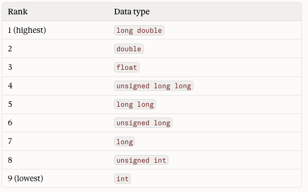
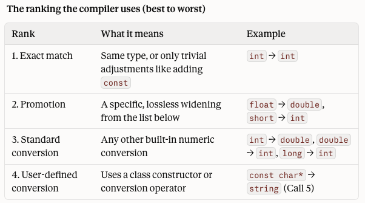

<!-- Topic 1: Function Overloading -->
<!-- Slides 3-25 -->

# Function Overloading
<!-- Slide 3 -->

## Same Name, Different Inputs? {.smaller}

+ When should related functions share one name?
+ Function overloading lets the parameter list explain which version is needed.

::: notes
Slides 3-25
:::

<!-- Slide 4 -->

---

## What Is Function Overloading?

+ Function overloading means defining multiple functions with the same name.
+ Each version must have a different parameter list.
+ The compiler chooses the version that matches the call.

<!-- Slide 5 -->

---

## Function Signatures

```cpp
void display(int value);
void display(double value);
void display(string value);
```

+ A signature uses the function name and parameter list.
+ Parameter type and count matter.
+ Return type and parameter names do not distinguish overloads.

<!-- Slide 6 -->

---

## Example Program: Displaying Values {.smaller}

```cpp
#include <iostream>
#include <string>
using namespace std;

void display(int value);
void display(double value);
void display(string value);

int main() {
    display(42);
    display(3.75);
    display("Overloaded display");
    return 0;
}

void display(int value) {
    cout << "int: " << value << endl;
}

void display(double value) {
    cout << "double: " << value << endl;
}

void display(string value) {
    cout << "string: " << value << endl;
}
```

<!-- Slide 7 -->

---

## Different Parameter Types

+ `display(42)` calls the `int` version.
+ `display(3.75)` calls the `double` version.
+ `display("Overloaded display")` calls the `string` version.

The function name stays the same because the operation is the same: display one value.

<!-- Slide 8 -->

---

## Example Program: Calculating Area {.smaller}

```cpp
#include <iostream>
using namespace std;

double area(double side);
double area(double length, double width);
double area(double base, double height, char shapeCode);

int main() {
    cout << area(4.0) << endl;
    cout << area(5.0, 3.0) << endl;
    cout << area(6.0, 2.5, 't') << endl;
    return 0;
}

double area(double side) {
    return side * side;
}

double area(double length, double width) {
    return length * width;
}

double area(double base, double height, char shapeCode) {
    if (shapeCode == 't') {
        return base * height / 2.0;
    }
    return base * height / 2.0;
}
```

<!-- Slide 9 -->

---

## Different Number of Parameters

+ `area(4.0)` computes a square area.
+ `area(5.0, 3.0)` computes a rectangle area.
+ `area(6.0, 2.5, 't')` computes a triangle area.

The number of arguments helps the compiler choose the intended version.

<!-- Slide 10 -->

---

## Return Type Is Not Enough

```cpp
int getValue();
double getValue();  // error
```

+ These functions have the same name and no parameters.
+ The compiler cannot choose between them from the call `getValue()`.
+ Overloads need different parameter lists.

<!-- Slide 11 -->

---

## How the Compiler Chooses

```cpp
void show(int value);
void show(double value);

show(10);
show(10.5);
```

+ The compiler first looks for an exact match.
+ `10` is an `int` literal, so it matches `show(int)`.
+ `10.5` is a `double` literal, so it matches `show(double)`.

<!-- Slide 12 -->

---

## Example Program: Formatting Reports {.smaller}

```cpp
#include <iostream>
#include <iomanip>
#include <string>
using namespace std;

void printReport(string label, int value);
void printReport(string label, double value);
void printReport(string label, int low, int high);

int main() {
    printReport("Count", 42);
    printReport("Average", 87.5);
    printReport("Range", 10, 100);
    return 0;
}

void printReport(string label, int value) {
    cout << label << ": " << value << endl;
}

void printReport(string label, double value) {
    cout << fixed << setprecision(1);
    cout << label << ": " << value << endl;
}

void printReport(string label, int low, int high) {
    cout << label << ": " << low << " to " << high << endl;
}
```

<!-- Slide 13 -->
---

## More than One Choice?

What happens when there's more than one function the compiler can choose?

+ Overload resolution compares the possible matches.
+ The compiler must decide which candidate is the best fit.

<!-- Slide 14 -->

---

## Promotion or Conversion

A function call may require a type change before it matches an overload.

+ A promotion is a special, pre-approved widening to int or to double.
+ A conversion is any other change of type.

<!-- Slide 15 -->

---

## Recall Promotions



<!-- Slide 16 -->

---

## Small Types are not Promoted

bool, char, signed char, unsigned char, short, and unsigned short aren't in the ranking. They're promoted to int before any comparison happens, following the promotion table from before.

<!-- Slide 17 -->

---

## Conversion is any other type change

Promotions are always lossless. Conversions are not always lossy: some lose data and some don't. So "lossless" is true of every promotion, but it isn't what makes something a promotion.

A promotion is simply one of the conversions on the fixed list from before. Everything else is a conversion, whether or not it loses data.

<!-- Slide 18 -->

---



<!-- Slide 19 -->

---

## Why does this matter?

This matters because the computer may be faced with several different possibilities to transform the type. In that situation, promotion always outranks conversion. The computer will choose that first.

<!-- Slide 20 -->

---

## Ambiguous Calls

```cpp
void convert(long value);
void convert(double value);

convert(10);
```

+ The call may require a conversion either way.
+ If no single overload is clearly best, the compiler reports an error.
+ C++ does not guess when overload resolution is ambiguous.

<!-- Slide 21 -->

---

## Default Arguments

Default arguments are not part of a function's signature. The function always has its full parameter list.

There is no promotion or conversion with a default argument: the argument must match the type specified in the signature.

<!-- Slide 22 -->

---

## Overloading vs. Different Function Names

| Use overloading when... | Use different names when... |
|---|---|
| the job is conceptually the same | the jobs are meaningfully different |
| parameter lists communicate the case | the shared name would hide intent |
| callers expect one operation family | callers need separate actions |

<!-- Slide 23 -->

---

## Common Practices

+ Use overloading to make related calls read naturally.
+ Keep overloads focused on one shared operation.
+ Avoid overloads that surprise the caller or depend on subtle conversions.

<!-- Slide 24 -->

---

## Summary

+ Overloaded functions share one name.
+ The parameter list distinguishes each version.
+ Good overloads make a function family easier to call and easier to read.

<!-- Slide 25 -->
