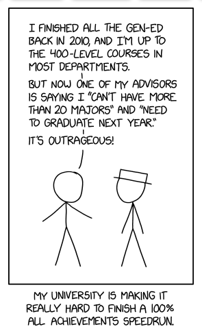

{fig-align="center" width="38%"}

<!-- Slide 1 -->

---

# Last Time

::: {.incremental}
+ **The Conditional Operator**
+ **The switch Statement**
+ **Nested if Statements**
+ **Compound Conditions**
+ **Range Checking**
:::

::: notes
Recall the previous lecture's decision structures: compact choices, fixed cases, dependent decisions, compound conditions, and range checks.
:::

<!-- Slide 2 -->

---

# Today's Agenda

- Very Brief Review of Static
- Design Patterns
- Singleton Pattern
- Menus and Functions

::: notes

:::

<!-- Slide 3 -->






---

# Key Takeaways

- Design patterns name recurring design choices.
- Static local storage can support a larger design rule, but it is not the design itself.
- Singleton controls access to one shared resource.
- Menu programs become clearer when display, input, dispatch, and actions have separate functions.

<!-- Slide 52 -->

---

# Next Time

<!-- Slide 53 -->

---

# Appendix

<!-- Slide 54 -->

---

## Very Brief Review of Static: Good Practices

- Use `static` local variables when a function intentionally needs memory between calls.
- Keep the remembered state small and easy to explain.
- Prefer visible parameters and return values when state does not need to persist.

<!-- Slide 55 -->

---

## Very Brief Review of Static: Common Mistakes

- Treating `static` as a shortcut for avoiding parameters.
- Forgetting that previous calls affect the next call.
- Assuming local scope means short lifetime.

<!-- Slide 56 -->

---

## Very Brief Review of Static: More Examples

```cpp
int nextId() {
    static int id = 1000;
    id++;
    return id;
}
```

Each call returns a new value because `id` keeps its previous value.

<!-- Slide 57 -->

---

## Very Brief Review of Static: Practice Problems

1. Predict the output of a function that increments a `static int count`.
2. Rewrite a static counter so the caller owns the counter instead.
3. Explain the difference between scope and lifetime in one sentence.

<!-- Slide 58 -->

---

## Very Brief Review of Static: AI Search Terms

- "C++ static local variable lifetime"
- "C++ scope vs lifetime static local"
- "C++ function remembers value between calls"

<!-- Slide 59 -->

---

## Very Brief Review of Static: Questions for Reflection

- When does hidden function memory make a program clearer?
- When does hidden function memory make a program harder to debug?

<!-- Slide 60 -->

---

## Design Patterns: Good Practices

- Start by naming the design problem.
- Use a pattern when it clarifies the structure of the solution.
- Explain the tradeoff every time you explain the pattern.

<!-- Slide 61 -->

---

## Design Patterns: Common Mistakes

- Choosing a pattern before understanding the problem.
- Treating patterns as recipes with fixed code.
- Adding structure that does not make the program easier to reason about.

<!-- Slide 62 -->

---

## Design Patterns: More Examples

| Pattern idea | Recurring problem |
|---|---|
| Singleton | exactly one shared resource |
| Adapter | make one interface fit another |
| Template Method | keep a stable process with replaceable steps |

<!-- Slide 63 -->

---

## Design Patterns: Practice Problems

1. Name a repeated design problem in a program you have written.
2. Decide whether that problem needs a named pattern or ordinary functions.
3. For one pattern, identify the problem, structure, and tradeoff.

<!-- Slide 64 -->

---

## Design Patterns: AI Search Terms

- "Christopher Alexander pattern language software design"
- "Gang of Four design patterns beginner"
- "design pattern problem structure tradeoff"

<!-- Slide 65 -->

---

## Design Patterns: Questions for Reflection

- Why is a shared vocabulary useful for design?
- What can go wrong when a pattern name becomes more important than the problem?

<!-- Slide 66 -->

---

## Singleton Pattern: Good Practices

- Use Singleton only when the single-resource rule is part of the problem.
- Keep the shared resource focused on one responsibility.
- Make shared state easy to find and explain.

<!-- Slide 67 -->

---

## Singleton Pattern: Common Mistakes

- Using Singleton as a disguised global variable.
- Storing unrelated program data in one shared resource.
- Ignoring the testing cost of hidden shared state.

<!-- Slide 68 -->

---

## Singleton Pattern: More Examples

```cpp
string& logFileName() {
    static string fileName = "program.log";
    return fileName;
}
```

A log file name is a small example because the program may want one coordinated output path.

<!-- Slide 69 -->

---

## Singleton Pattern: Practice Problems

1. Decide whether a report counter should use one shared value.
2. List one reason a settings file name might need exactly one shared access point.
3. List one reason a settings value might not belong in a Singleton.

<!-- Slide 70 -->

---

## Singleton Pattern: AI Search Terms

- "C++ Singleton static local value"
- "Singleton pattern tradeoffs shared state"
- "Singleton disguised global variable"

<!-- Slide 71 -->

---

## Singleton Pattern: Questions for Reflection

- What does Singleton make easier?
- What does Singleton hide from the caller?

<!-- Slide 72 -->

---

## Menus and Functions: Good Practices

- Keep display, input, dispatch, and action responsibilities separate.
- Let `main()` coordinate the menu instead of performing every task itself.

<!-- Slide 73 -->

---

## Menus and Functions: Common Mistakes

- Putting the entire menu program inside `main()`.
- Forgetting that an action needs a reference parameter to update caller-owned state.

<!-- Slide 74 -->

---

## Menus and Functions: More Examples

```cpp
void showBalance(double balance) {
    cout << "Balance: $" << balance << endl;
}
```

<!-- Slide 75 -->

---

## Menus and Functions: Practice Problems

- Separate a monolithic menu into display, input, dispatch, and action functions.
- Identify which action functions need a reference parameter.
- Add a quit option to a menu loop.

<!-- Slide 76 -->

---

## Menus and Functions: AI Search Terms

- C++ menu-driven program functions
- C++ function dispatch menu
- C++ reference parameter update caller
- C++ default parameters display helper

<!-- Slide 77 -->

---

## Menus and Functions: Questions for Reflection

- Which function owns each menu responsibility?
- Where does the selected choice become an action?
- Which values must be returned and which must be updated by reference?

<!-- Slide 78 -->
