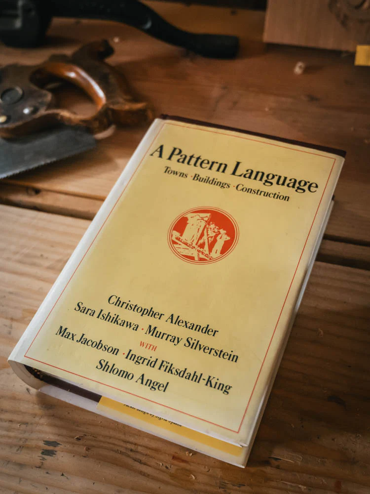
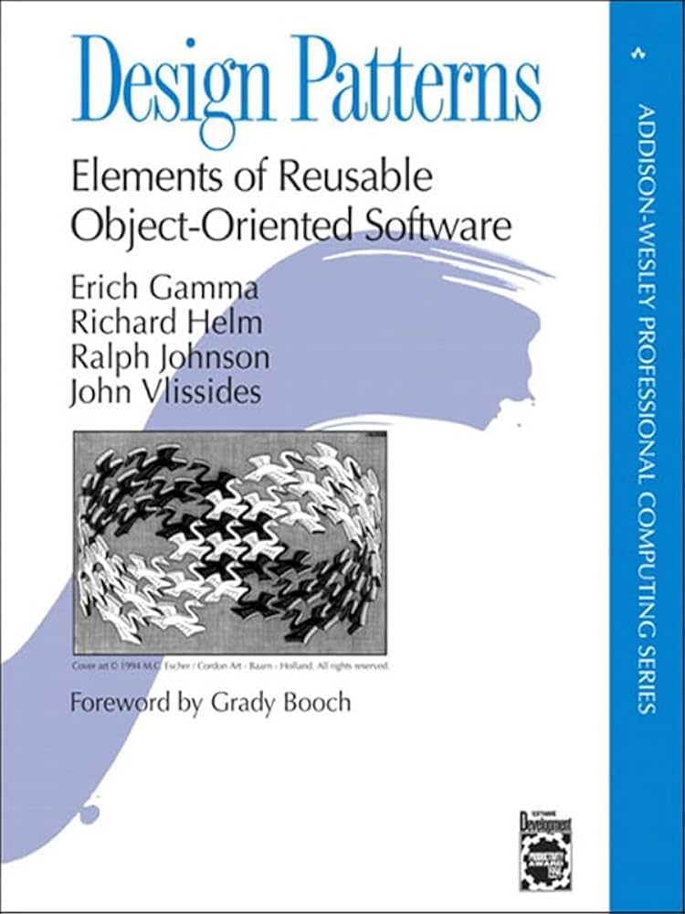
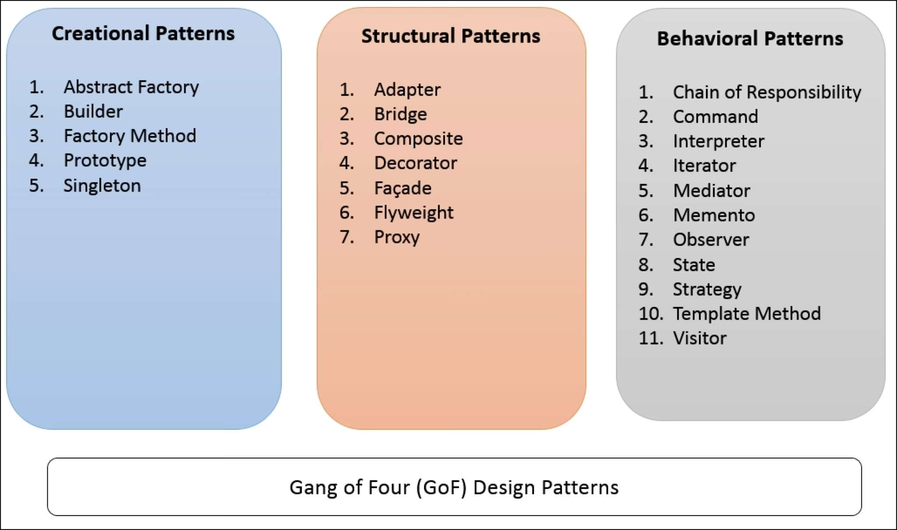

<!-- Topic 2: Design Patterns -->
<!-- Slides 8-20 -->

# Design Patterns
<!-- Slide 8 -->

## Why Name Solutions? {.smaller}

+ Programmers run into the same design problems again and again.
+ A shared name lets a team discuss the shape of a solution without redrawing it from scratch.

::: notes
Slides 8-20
:::

<!-- Slide 9 -->

---

## Christopher Alexander

::: {.columns}
::: {.column width="55%"}
+ Architect Christopher Alexander wrote about recurring design problems in buildings and towns.
+ His patterns described problems, forces, and reusable solution shapes.
+ The idea was not "copy this building"; it was "recognize this design situation."
:::

::: {.column width="45%"}
{fig-align="center" width="78%"}
:::
:::

<!-- Slide 10 -->

---

## A Pattern Language

::: {.columns}
::: {.column width="55%"}
+ Alexander's larger idea was a connected vocabulary of design choices.
+ Small patterns and large patterns could work together.
+ The value came from communication as much as construction.
:::

::: {.column width="45%"}
{fig-align="center" width="64%"}
:::
:::

<!-- Slide 11 -->

---

## From Buildings to Software

+ Software also has recurring design problems.
+ The exact code changes from program to program.
+ The design shape can still be recognized, discussed, and reused.

<!-- Slide 12 -->

---

## The Gang of Four Book

::: {.columns}
::: {.column width="55%"}
+ The Gang of Four book popularized software design patterns.
+ The authors are Erich Gamma, Richard Helm, Ralph Johnson, and John Vlissides.
+ They are often called the Gang of Four.
:::

::: {.column width="45%"}
{fig-align="center" width="64%"}
:::
:::

<!-- Slide 13 -->

---

## What Is a Design Pattern?

+ A design pattern is a reusable approach to a recurring design problem.
+ It names the problem, the structure, and the tradeoff.
+ The pattern is about intent, not memorized code.

<!-- Slide 14 -->

---

## What Patterns Are Not

+ Patterns are not syntax rules.
+ Patterns are not libraries.
+ Patterns are not guaranteed best practices.
+ Patterns are design vocabulary with consequences.

<!-- Slide 15 -->

---

## Pattern, Not Recipe

+ A recipe gives exact steps.
+ A pattern gives a shape that must be adapted to the program.
+ The same pattern may look different in small, medium, and large programs.

<!-- Slide 16 -->

---

## The Three Questions

+ What problem does this pattern solve?
+ What structure does it use?
+ What tradeoff does it introduce?

<!-- Slide 17 -->

---

## Common Practices

+ Start with the problem, not the pattern name.
+ Use the smallest structure that makes the design clearer.
+ Avoid adding pattern machinery when ordinary code is enough.

<!-- Slide 18 -->

---

## Pattern Categories

{fig-align="center" width="86%"}

<!-- Slide 19 -->

---

## Summary

+ Design patterns name recurring design choices.
+ They help programmers recognize, explain, and maintain structure.
+ Every pattern also has a cost.

<!-- Slide 20 -->
