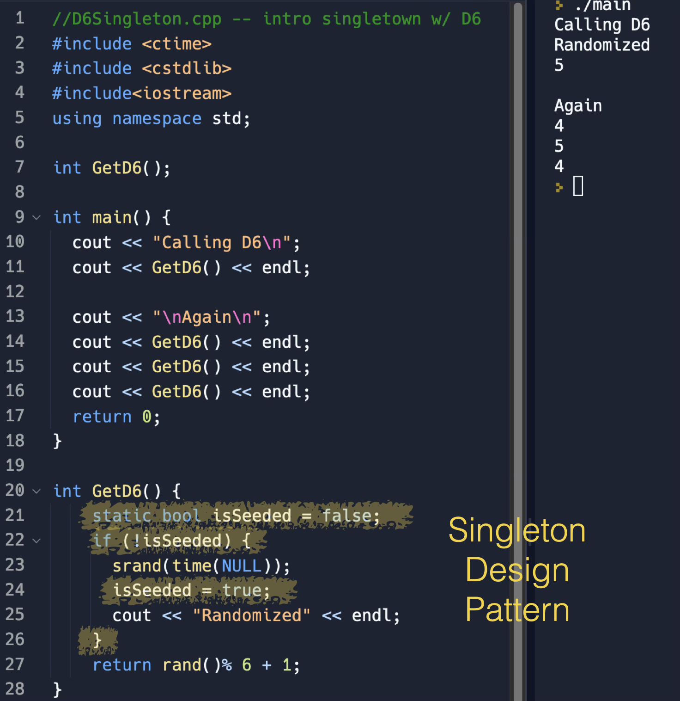
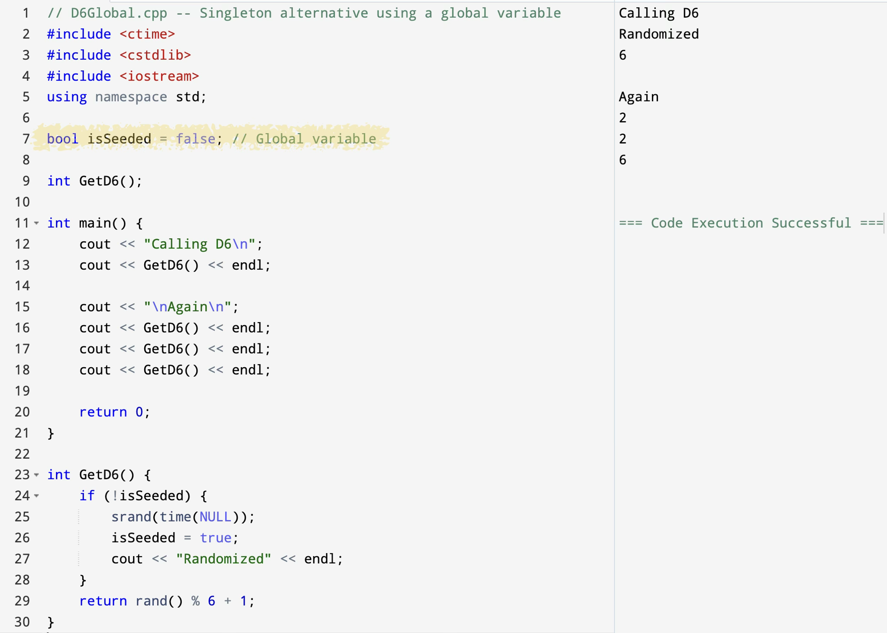

<!-- Topic 3: Singleton Pattern -->
<!-- Slides 22-33 -->

# Singleton Pattern
<!-- Slide 22 -->

## What If There Should Only Be One? {.smaller}

+ Some program resources should not have many independent copies.
+ A file name, counter, settings value, or shared output path may need one controlled access point.

::: notes
Slides 22-33
:::

<!-- Slide 23 -->

---

## Singleton Pattern

+ Singleton controls access so a program uses one shared resource.
+ The program reaches that resource through one function.
+ Other code asks for the shared resource instead of creating separate copies.

<!-- Slide 24 -->

---

## One Resource, One Access Point

| Rule | Meaning |
|---|---|
| one resource | the program should not create several copies of the same resource |
| controlled access | other code reaches the resource through one function |
| shared state | callers see the same stored data |

<!-- Slide 25 -->

---

## A Simple Singleton Shape

{fig-align="center" width="86%"}

::: notes
The highlighted `static` local value is the controlled shared resource. The function is the access point.
:::

<!-- Slide 26 -->

---

## Contrast: Global Variable

{fig-align="center" width="86%"}

::: notes
Use this slide to contrast the global-variable version with the static-local version. Both preserve shared state, but the global version exposes the state more broadly.
:::

<!-- Slide 27 -->

---

## Why Static Shows Up Here

```{.cpp}
int& nextReportNumber() {
    static int reportNumber = 1000;
    return reportNumber;
}
```

+ The local `static` value is created once.
+ Each later call reaches the same stored value.
+ The value is kept inside the access function's control.

<!-- Slide 28 -->

---

## Example: Program Settings

+ Several functions may need the same display mode, file path, or course setting.
+ A Singleton can keep those values in one shared place.
+ The pattern says the shared place is intentional, not accidental.

::: notes
[Graphic suggestion: several program areas pointing to one settings access function.]
:::

<!-- Slide 29 -->

---

## The Tradeoff

+ Singleton makes access convenient.
+ It also creates shared state.
+ Shared state can make testing and order-of-calls harder to reason about.

<!-- Slide 30 -->

---

## When Singleton Is a Bad Fit

+ The data could be passed as a parameter.
+ The program may need multiple versions later.
+ The shared value changes in ways callers cannot easily see.

<!-- Slide 31 -->

---

## Common Practices

+ Use Singleton only when one shared resource is part of the problem.
+ Keep the shared resource small and focused.
+ Do not use Singleton as a disguised global variable.

<!-- Slide 32 -->

---

## Summary

+ Singleton controls access to one shared resource.
+ It is useful when the single-resource rule is intentional.
+ It should be chosen for a design reason, not convenience alone.

<!-- Slide 33 -->
