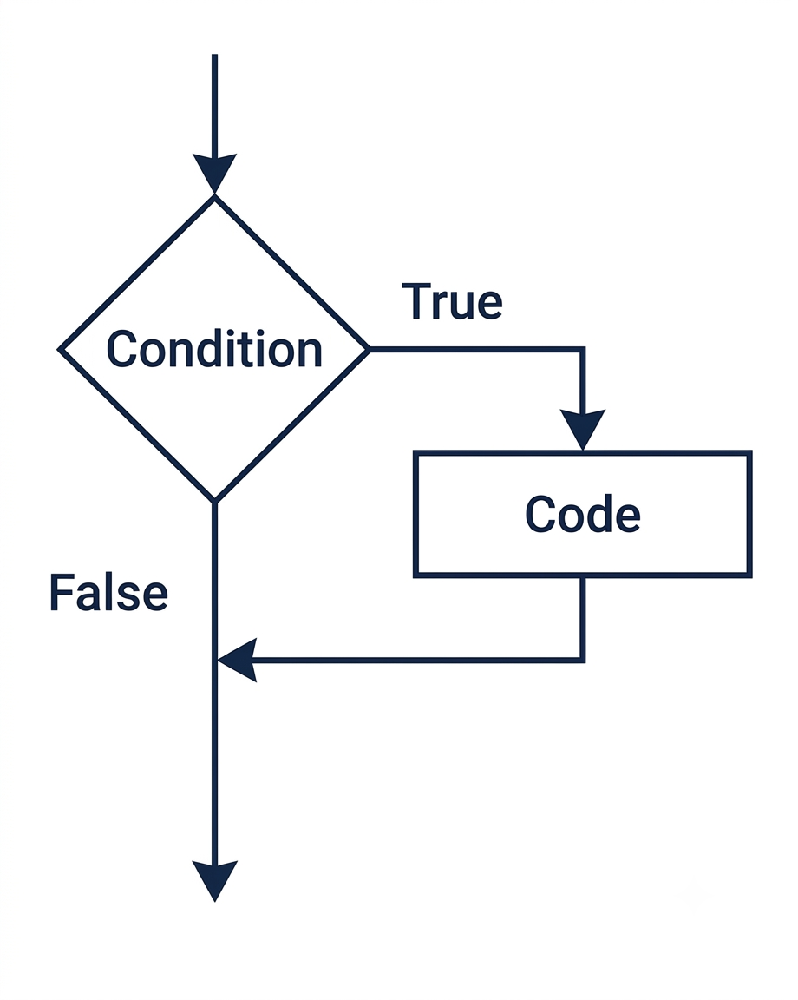

<!-- Topic 2: The if Statement -->
<!-- Slides 13-21 -->

# The if Statement
<!-- Slide 13 -->

## Doing Something Only Sometimes {.smaller}

+ What should a program do when an action depends on a condition?
+ An `if` statement gives the program one conditional action.

::: notes
Slides 13-21
:::

<!-- Slide 14 -->

---

## The Shape of an if Statement

```cpp
#include <iostream>
using namespace std;

int main()
{
    int number;

    cout << "Enter an integer.\n";
    cout << "I'll tell you if it's zero.";
    cin >> number;

    if (number == 0) {
        cout << "You entered a zero." << endl;
    }

    return 0;
}
```

::: notes
Notice the `==` in the condition. This example asks a question before it prints the message.
:::

<!-- Slide 15 -->

---

## Condition First, Action Second

{fig-alt="Flowchart showing an if statement: when the condition is true, code runs; when false, execution skips the code." style="max-height: 500px;"}

::: notes
Evaluate the condition first. If it is true, run the block. If it is false, skip the block.
:::

<!-- Slide 16 -->

---

## One Statement or a Block

```cpp
if (temperature < 32) {
    cout << "Freezing";
    cout << "Watch for ice";
}
```

Braces make the controlled region visible. Use them even when the block starts with one statement.

<!-- Slide 17 -->

---

## Protecting Code from Bad Inputs

```cpp
#include <iostream>
using namespace std;

int main() {
    double num1, num2, quotient;

    cout << "Enter two numbers: ";
    cin >> num1 >> num2;

    if (num2 != 0) {
        quotient = num1 / num2;
        cout << "The quotient is " << quotient << endl;
    }

    return 0;
}
```

::: notes
The condition protects the division. The calculation runs only when the denominator is safe to use.
:::

<!-- Slide 18 -->

---

## Comparing Two Values

```cpp
if (first > second) {
    cout << "First is larger";
}

if (first == second) {
    cout << "The values match";
}
```

Separate `if` statements ask separate questions.

<!-- Slide 19 -->

---

## Reading if Statements Out Loud

```cpp
if (temperature < 32) {
    cout << "Freezing";
}
```

Read this as: if `temperature` is less than 32, print `"Freezing"`.

<!-- Slide 20 -->

---

## Summary

- An `if` statement runs a block only when its condition is true.
- The condition must evaluate to `true` or `false`.
- Code outside the block is not controlled by the `if` statement.

<!-- Slide 21 -->
