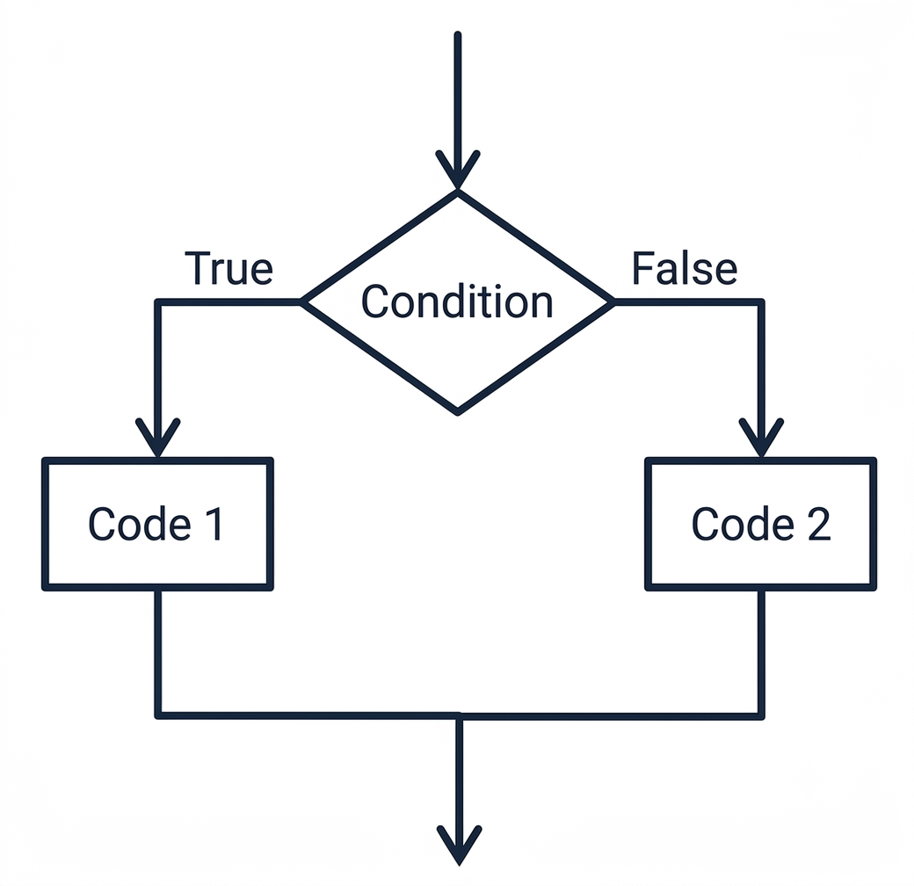

<!-- Topic 4: The if/else Statement -->
<!-- Slides 31-39 -->

# The if/else Statement
<!-- Slide 31 -->

## Two Possible Paths {.smaller}

+ What should a program do when one action happens if a condition is true, and a different action happens if it is false?
+ An `if/else` statement gives the program two mutually exclusive paths.

::: notes
Slides 31-39
:::

<!-- Slide 32 -->

---

## One Decision, Two Outcomes

{fig-alt="Flowchart showing an if/else statement with a true branch and a false branch that rejoin after the decision." style="max-height: 460px;"}

Exactly one branch runs, then the paths rejoin.

<!-- Slide 33 -->

---

## The Shape of if/else

```cpp
if (x > 0) {
    y = 10;
} else {
    y = -10;
}
```

The `else` branch belongs to the condition above it. If the question is false, the alternate action runs.

<!-- Slide 34 -->

---

## Exactly One Branch Runs

```cpp
if (num2 != 0) {
    quotient = num1 / num2;
    cout << "The quotient is " << quotient << endl;
} else {
    cout << "Division by zero is not possible.\n";
    cout << "Please rerun program." << endl;
}
```

::: notes
This is the same zero-divisor example extended into an if/else. The program either divides or prints the error message.
:::

<!-- Slide 35 -->

---

## Night Club Example

```cpp
if (age >= 21) {
    cout << "Admit";
} else {
    cout << "Do not admit";
}
```

The condition asks whether the person meets the age requirement. The `else` handles everyone who does not.

<!-- Slide 36 -->

---

## if vs. if/else

Use separate `if` statements when both conditions could be true.

Use `if/else` when one path must be true and the other must be false.

<!-- Slide 37 -->

---

## Avoid Opposite Conditions

```cpp
if (age >= 21) {
    cout << "Admit";
} else {
    cout << "Do not admit";
}
```

The `else` already means the condition was false. A second opposite test is not needed.

<!-- Slide 38 -->

---

## Summary

- `if/else` creates a two-way decision.
- The `if` branch runs when the condition is true.
- The `else` branch runs when the condition is false.

<!-- Slide 39 -->
