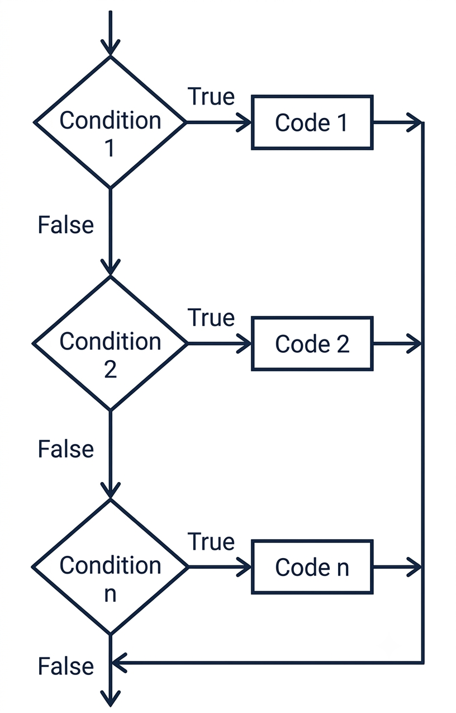

<!-- Topic 5: The if/else if Statement -->
<!-- Slides 40-50 -->

# The if/else if Statement
<!-- Slide 40 -->

## More Than Two Outcomes {.smaller}

+ What should a program do when a decision has several possible categories?
+ An `if/else if` chain checks multiple conditions in order.

::: notes
Slides 40-50
:::

<!-- Slide 41 -->

---

## The Shape of if/else if

{fig-alt="Flowchart showing an if/else if chain with multiple conditions checked in order." style="max-height: 520px;"}

::: notes
The chain begins with `if`, then checks each `else if` only if the earlier condition was false.
:::

<!-- Slide 42 -->

---

## Checked From Top to Bottom

The program checks the first condition.

If that condition is false, the program moves to the next condition. The first true branch runs, and the rest are skipped.

<!-- Slide 43 -->

---

## Starter if

```cpp
if (score >= 90) {
    grade = 'A';
}
```

The first `if` starts the chain. It should represent the first category the program needs to test.

<!-- Slide 44 -->

---

## else if Conditions

```cpp
else if (score >= 80) {
    grade = 'B';
} else if (score >= 70) {
    grade = 'C';
}
```

Each `else if` adds another possible category.

<!-- Slide 45 -->

---

## Default else

```cpp
else {
    grade = 'F';
}
```

The final `else` handles none of the above. It gives the chain a default outcome.

<!-- Slide 46 -->

---

## Grade Category Example

```cpp
if (testScore >= MIN_A) {
    grade = 'A';
} else if (testScore >= MIN_B) {
    grade = 'B';
} else if (testScore >= MIN_C) {
    grade = 'C';
} else if (testScore >= MIN_D) {
    grade = 'D';
} else if (testScore >= MIN_POSSIBLE) {
    grade = 'F';
} else {
    goodScore = false;
}
```

::: notes
Each score belongs to one category. A negative score is handled by the final else.
:::

<!-- Slide 47 -->

---

## Order Matters

```cpp
if (score >= 70) {
    grade = 'C';
} else if (score >= 90) {
    grade = 'A';
}
```

A score of 95 never reaches the second branch because the first condition is already true.

<!-- Slide 48 -->

---

## Choosing the Right Conditional Shape

| Need | Use |
|---|---|
| Do something only when true | `if` |
| Choose between two paths | `if/else` |
| Choose among several categories | `if/else if` |

<!-- Slide 49 -->

---

## Summary

- An `if/else if` chain handles several mutually exclusive categories.
- Conditions are checked from top to bottom.
- The first true branch runs, and the rest are skipped.

<!-- Slide 50 -->
