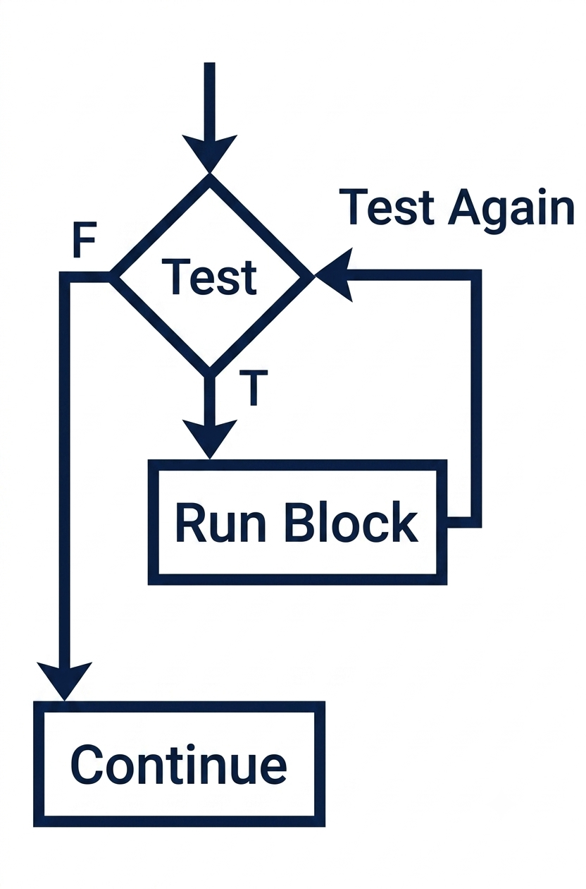

<!-- Topic 2: Loop Anatomy and Program Control -->
<!-- Slides 9-19 -->

# Loop Anatomy and Program Control
<!-- Slide 9 -->

## A Loop You Already Know {.smaller}

- A range-based `for` loop says: do this once for each item in a collection.
- You have already used loops when reading or displaying every value in a vector.

::: notes
Slides 9-19
:::

<!-- Slide 10 -->

---

## What for-each Hides

```cpp
for (int score : scores) {
    cout << score << endl;
}
```

The loop visits each element, but the stopping condition and movement through the collection are handled for you.

<!-- Slide 11 -->

---

## That Sounds Like an if Statement

- Both `if` statements and loops use a condition.
- The condition decides whether a block should run.
- The difference is what happens after the block finishes.

<!-- Slide 12 -->

---

## The Difference Is Control Flow

| Structure | After the Block |
|---|---|
| `if` | Continue to the next statement |
| Loop | Return to the loop condition or end the loop |

<!-- Slide 13 -->

---

## if vs. Loop Control Flow

::: {.columns}
::: {.column width="50%"}
**if**

{fig-alt="Control flow for an if statement" width="52%"}
:::

::: {.column width="50%"}
**loop**

{fig-alt="Control flow for a loop statement" width="68%"}
:::
:::

<!-- Slide 14 -->

---

## The Three Pieces of a Loop

- **Condition**: the true/false test that controls repetition.
- **Control variable**: the value that helps decide whether to continue.
- **Body**: the block of work that repeats.

<!-- Slide 15 -->

---

## Entry vs. Exit Conditions

::: {.columns}
::: {.column width="50%"}
{fig-alt="Entry-condition while loop flowchart" width="58%"}
:::

::: {.column width="50%"}
{fig-alt="Exit-condition do-while loop flowchart" width="58%"}
:::
:::

Entry-condition loops may run zero times. Exit-condition loops run at least once.

<!-- Slide 16 -->

---

## The Condition Must Change

- A loop must move toward stopping.
- That usually means input changes, a counter changes, or a flag changes.
- If the condition never becomes false, the loop does not end.

<!-- Slide 17 -->

---

## Tracing the Control Variable

| Pass | `count` | Condition `count <= 3` | Output |
|---:|---:|---|---|
| 1 | 1 | true | 1 |
| 2 | 2 | true | 2 |
| 3 | 3 | true | 3 |
| 4 | 4 | false | stop |

<!-- Slide 18 -->

---

## Summary

- Explicit loops expose the control machinery that range-based `for` keeps out of sight.
- A loop is a decision plus a path back to the decision.

<!-- Slide 19 -->
