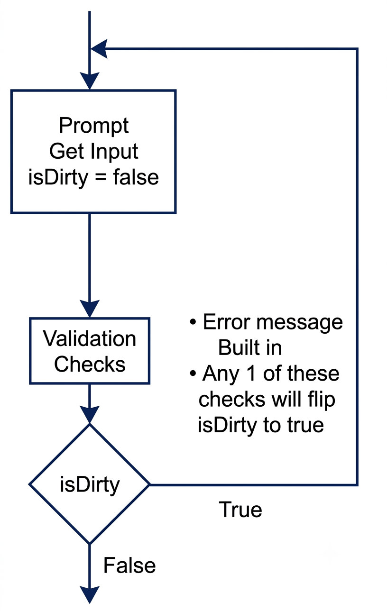
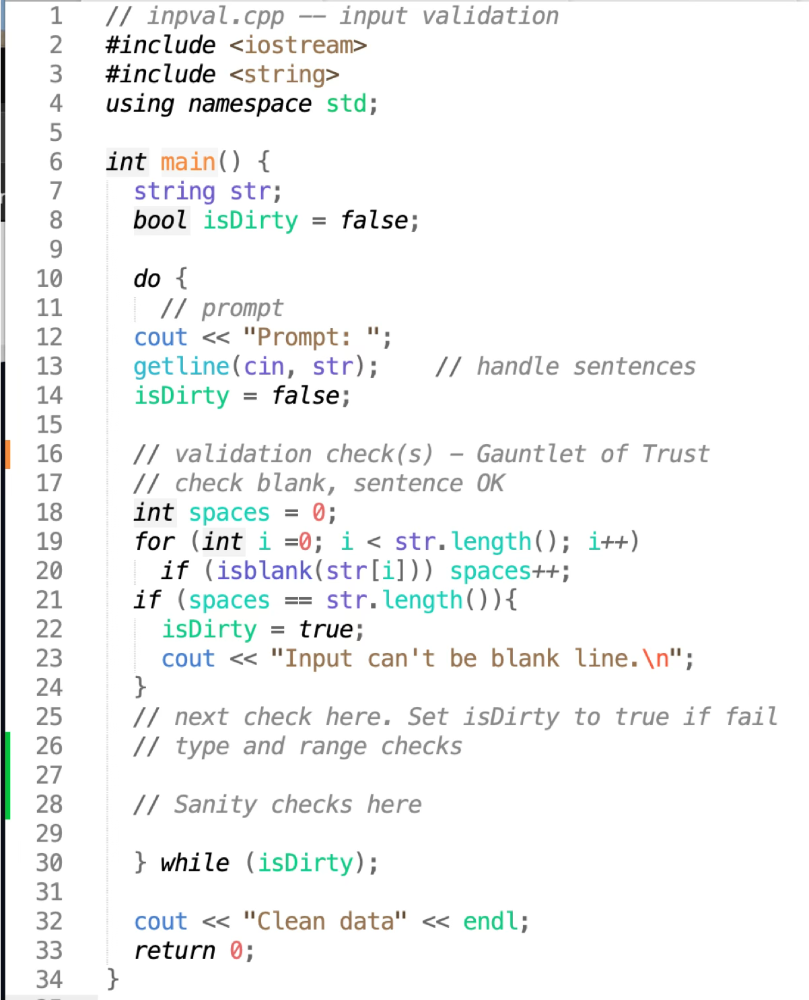
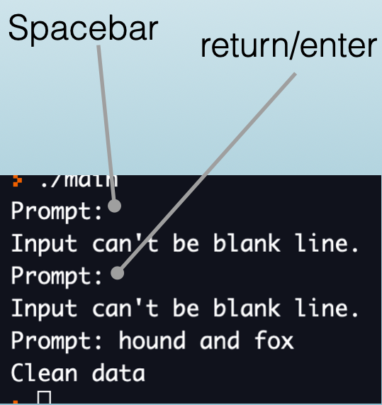

<!-- Topic 5: Input Validation -->
<!-- Slides 44-57 -->

# Input Validation
<!-- Slide 44 -->

## What Makes Input Safe To Use? {.smaller}

Input validation checks client data before the rest of the program trusts it. The goal is to reject bad input early, explain the problem, and ask again.

::: notes
Slides 44-57
:::

<!-- Slide 45 -->

---


## Validate At The Boundary

The best time to validate input is immediately after reading it.

- The client enters raw data.
- The validation code decides whether the data is acceptable.
- The rest of the program receives data that has already been checked.

Do not let questionable data travel deeper into the program.

<!-- Slide 46 -->

---


## The Minimum Behavior

A validation loop should do three things.

- State what is wrong.
- Tell the client what valid input looks like.
- Reprompt until the input is usable.

"Invalid input" is rarely enough. A useful message teaches the client how to recover.

<!-- Slide 47 -->

---


## Range Validation

```cpp
int score;

cout << "Enter a score (0-100): ";
cin >> score;

while (score < 0 || score > 100) {
    cout << "Score must be between 0 and 100. Try again: ";
    cin >> score;
}
```

The loop condition describes bad data. The loop stops when the value is acceptable.

<!-- Slide 48 -->

---


## Set Validation

```cpp
char answer;

cout << "Continue? (Y/N): ";
cin >> answer;

while (answer != 'Y' && answer != 'N') {
    cout << "Enter Y or N: ";
    cin >> answer;
}
```

Use set validation when the legal values are specific choices rather than a continuous range.

<!-- Slide 49 -->

---


## The Priming Read

A `while` validation loop needs a first value to test.

```cpp
cin >> value;                 // priming read

while (value is invalid) {
    cout << "Try again: ";
    cin >> value;             // replacement read
}
```

Without the priming read, the first condition check has no meaningful input value.

<!-- Slide 50 -->

---


## Validate Before Processing

```cpp
int count;

cout << "How many scores (1-30)? ";
cin >> count;

while (count < 1 || count > 30) {
    cout << "Enter a count from 1 to 30: ";
    cin >> count;
}

for (int i = 1; i <= count; i++) {
    cout << "Score " << i << ": ";
}
```

The loop that uses `count` should not run until `count` has been validated.

<!-- Slide 51 -->

---


## Type Failure Is Different

Range validation assumes the extraction succeeded. If the client types `abc` for an integer, `cin` enters a failed state.

```cpp
while (!(cin >> age)) {
    cin.clear();
    cin.ignore(10000, '\n');
    cout << "Enter a whole-number age: ";
}
```

Recover from type failure before applying ordinary range checks.

<!-- Slide 52 -->

---


## Simple Validation

```cpp
int age;

cout << "Enter your age (1-120): ";

while (!(cin >> age) || age < 1 || age > 120) {
    cin.clear();
    cin.ignore(10000, '\n');
    cout << "Enter a whole-number age from 1 to 120: ";
}
```

This combines type recovery with range validation in one loop.

<!-- Slide 53 -->

---


## The Gauntlet of Trust



<!-- Slide 54 -->

---


## Complex Validation



<!-- Slide 55 -->

---


## Complex Validation: Code and Output

::: {.columns}
::: {.column width="50%"}

:::

::: {.column width="50%"}

:::
:::

<!-- Slide 56 -->

---


## Summary

Input validation protects the program boundary. Read the value, reject invalid data with a specific message, reprompt, and only process the value after it passes the check.

<!-- Slide 57 -->
