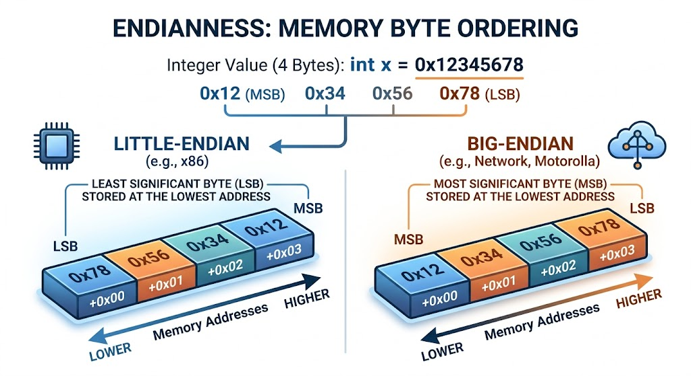

<!-- Topic 6: Memory Inspection with C++ -->
<!-- Total slides: 9 -->

# Memory Inspection with C++

---

## What is actually stored at a memory address? {.smaller}

- Every variable lives at an address — you can print that address and read the bytes stored there
- This is not something you do in production code, but it demystifies how memory works

::: notes
Total slides: 9
:::

<!-- Slide 1 -->

---

## Printing addresses

```{.cpp}
#include <iostream>
using namespace std;

int main() {
    int x = 42;
    double d = 3.14;
    int arr[3] = {10, 20, 30};

    cout << "address of x:      " << &x      << "\n";
    cout << "address of d:      " << &d      << "\n";
    cout << "address of arr[0]: " << arr     << "\n";
    cout << "address of arr[1]: " << arr + 1 << "\n";
    return 0;
}
```

- `&x` yields a pointer; `cout` prints it in hexadecimal
- `arr + 1` is 4 bytes past `arr` — one `int` forward

<!-- Slide 2 -->

---

## Inspecting raw bytes with reinterpret_cast

```{.cpp}
#include <iostream>
using namespace std;

void printBytes(const void* ptr, int count) {
    const unsigned char* p = reinterpret_cast<const unsigned char*>(ptr);
    for (int i = 0; i < count; i++)
        cout << hex << static_cast<int>(p[i]) << " ";
    cout << dec << "\n";
}

int main() {
    int x = 305419896;   // 0x12345678
    printBytes(&x, sizeof(x));
    return 0;
}
```

::: notes
`reinterpret_cast<const unsigned char*>` treats any address as a sequence of raw bytes. Output reveals byte order — most x86 systems store the least significant byte first (little-endian).
:::

<!-- Slide 3 -->

---

## What the output shows

```
78 56 34 12
```

::: notes
`int x = 0x12345678` occupies four bytes. On a little-endian system, the lowest-value byte (0x78) is stored at the lowest address. On a big-endian system the order reverses: 12 34 56 78.
:::

<!-- Slide 4 -->

---

## Little-endian and Big-endian

- **Endianness** — the order in which bytes of a multi-byte value are stored in memory
- **Little-endian**: the least significant byte (LSB) is stored at the lowest address — used by x86 and AMD64 processors
- **Big-endian**: the most significant byte (MSB) is stored at the lowest address — used by network protocols (TCP/IP) and some embedded systems

::: notes
Why does endianness exist? Different CPU architectures made independent byte-order decisions early in computing history, and both choices have minor practical advantages. Little-endian (Intel x86/AMD64) stores the least significant byte at the base address — this simplifies certain arithmetic operations because carry propagates naturally from low address to high. Big-endian (Motorola 68k, IBM mainframes, network protocols) stores the most significant byte first, which matches how humans write numbers and makes it easy to inspect a value by reading the first byte. Neither order is universally "correct." The conflict became a practical problem when machines needed to communicate: TCP/IP standardized on big-endian, which is why it is called "network byte order." Code that sends multi-byte values across a network must convert between host byte order and network byte order using functions like htons() and ntohl().
:::

<!-- Slide 5 -->

---

## Memory layout: storing 0x12345678 {.smaller}

{width="85%"}

::: notes
**Most significant bit (MSB):** The bit with the greatest positional value — the leftmost bit in a byte (bit 7, worth 2^7 = 128). For a multi-byte value, the MSB lives in the highest-value byte. Changing the MSB has the largest effect on the number.

**Least significant bit (LSB):** The bit with the smallest positional value — the rightmost bit in a byte (bit 0, worth 2^0 = 1). For a multi-byte value, the LSB lives in the lowest-value byte. Changing the LSB changes the number by exactly 1.

These terms apply to bytes as well: the most significant byte (MSByte) holds the high-order bits; the least significant byte (LSByte) holds the low-order bits. Little-endian stores the LSByte at the lowest memory address; big-endian stores the MSByte there. A double uses 8 bytes in IEEE 754 format — the bits encode sign, exponent, and mantissa — and is subject to the same byte-order rules as any other multi-byte type.
:::

<!-- Slide 7 -->

---

## Summary

- `&variable` gives you the address; `reinterpret_cast<const unsigned char*>` lets you walk the raw bytes
- Memory inspection reveals endianness, type sizes, and encoding — tools every systems programmer uses

<!-- Slide 8 -->
