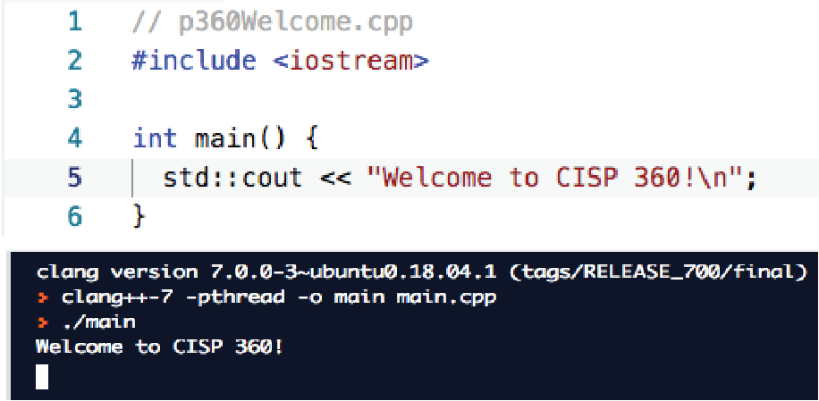

# CISP 360

**Introduction to Structured Programming**  
**Course Syllabus**  
Fall 2026

## Course Description

This course is an introduction to structured programming using the C++ (see plus plus) programming language. It will introduce you to the art and science of capturing thoughts and making them real - programming! You will learn and practice the syntax of the C++ programming language. Furthermore, you will be exposed to other necessary skills of programming, such as debugging and testing.

This course has a prerequisite. You must have taken and passed CISP 300 with a grade "C" or higher. If you have other experience which you feel may count in place of the prerequisite, come and see me immediately.

If FLC cannot verify your prerequisites, you will need to file a Prerequisite Challenge Form immediately . You can find this online and must be delivered with the supporting documents to the Dean’s office. Copy me on your email so I know you are in the process of challenging the prerequisite. You must start this process by the end of the first Sunday before our first face to face class meets. It must be completed by the end of the first week of the semester.

This class has a lab component. The lab is after class, on your own time. A lab is an informal work time - you will be programming.

## Where Can I Go for the Latest Course Information?

The Folsom Lake College website has the most current information.

- [Main Catalog Page.](https://flc.losrios.edu/2025-2026-official-catalog)
- [Class schedules.](https://flc.losrios.edu/academics/search-class-schedules?flcFilter=true&openFilter=true&waitlistFilter=true&strm=1259,Fall%202025&link=true)
- [Academic Calendar.](https://flc.losrios.edu/admissions/academic-calendar-and-deadlines)
- [Final Schedule.](https://flc.losrios.edu/admissions/academic-calendar-and-deadlines/final-exam-schedule)
- [Prerequisite Challenge info](https://flc.losrios.edu/admissions/placement/prerequisite-verification-and-challenge) - form link about half way down the page.

## Does This Class Have a Lab and What Exactly Does That Mean?

This class has a lab component. The lab is after class, on your own time. You will be involved in some classroom computer activities, but they will be structured and not as free form as a lab would be. A lab is an informal work time - you will be programming.

## Contacting Me

My office hours are Monday through Thursday at 12:00 (noon). You can use Student Connect in Canvas to schedule a Zoom appointment. If these times don’t work for you, send me an email and we can set something else up.

You can get in touch with me in the following ways:

1. My office (FL2 - 236) is the best way to contact me. Schedule an appointment and I guarantee I will be there. If you drop in, I will probably be out and you will need to wait.
2. Call me at my office (916) 608-6595. If I am unavailable leave a voicemail - they are emailed to me.
3. Send me an email. I do not check email past noon on Saturdays and not at all on Sundays. It is not unusual for me respond in a few days - I have lot’s of student inquiries. Pro-Tip: Put the class number in the subject of your email (CISP 400 or p400) and my inbox will priority flag it and move it to the top of the list!

None of these methods are immediate. If you need to see me NOW, you will need to come and find me. Plan accordingly.

## Student Learning Outcomes

The State Chancellor’s Office wants to know if we are measuring our student success rates against the Student Learning Outcomes (SLOs) standard. Upon completion of this course, the student will be able to:

1. Organize C/C++ code into modules.
2. Create C/C++ programs demonstrating file operations, pointers, and/or structures.
3. Create programming problem solutions in C/C++ using selection statements.
4. Create programming problem solutions in C/C++ using iteration.
5. Create programming problem solutions in C/C++ demonstrating the appropriate use of single and multidimensional array data structures.
6. Create programming problem solutions in C/C++ demonstrating the appropriate use of dynamic memory.

## Text and Required Supplies

You will need access to a computer. I use Canvas to coordinate all classroom activities - even in my classroom courses. You will need to take notes – my lectures are insufficient for learning the material. Finally, you will need to acquire and read the textbook.

Your client (me) will be using a Ubuntu Linux system to compile and run your work on. We will use the standard C++ libraries only. The gcc compiler will be used to check your code. You have several choices as to how you want to access these tools. 
First, all the tools you need are installed with the Desktop installation of Ubuntu - you will not need to install anything else. You would install virtualization software like VMware, and then install the desktop with that. This is nowhere near as hard as it was several years ago, but I would not say that it is a trivial process. If you are thinking of working in the computer industry, this would be a good skill to have, however. If this interests you, I suggest you check out YouTube videos on how to set this up. These are far more current than anything that I have to offer.
Your second choice is using one of the online compliers (replit.com, programiz, onlinegdb c++) to compile and run your program. These online resources run the compiler that we use in the back end. That makes them suitable for working in this class as well. This is by far the easiest solution for today. You type your code in the included editor and you hit the green button and your program compiles (hopefully).

### Textbook

Gaddis, Walters, Muganda (2019). C++ Early Objects (10th ed.).  
ISBN: 978-0135235003.  
Upper Saddle River, NJ: Pearson Education.

When I refer to chapters, it is the chapters in this book I’m referring to. That’s changing as I update the material. You may want to simply look for the topics in whatever textbook you choose to use.

This is also a good online reference:  
[https://www.learncpp.com/](https://www.learncpp.com/)

## Course Schedule & Grade Plan

The table below is a high-level overview of the course sequence. For lecture dates, assignment details, deadlines, closures, and finals information, see the [full course calendar](../calendar.html).

### Course Topics

| Course topic | Brief summary |
| --- | --- |
| C++ Foundations, Functions, and Program Design | Review program structure, variables, data types, terminal input and output, IPO models, execution traces, scope, functions, parameter passing, and coding practices that support larger programs. |
| Selection, Iteration, Menus, and Input Validation | Use relational and logical operators, conditional statements, loops, nested loops, menu architectures, counters, accumulators, searches, and validation strategies to control program behavior. |
| Vectors, Arrays, and Algorithms | Work with vectors, multidimensional vectors, fixed-size arrays, C-strings, `std::array`, parallel data, traversal, searching, sorting, and standard vector algorithms. |
| File I/O, String Streams, and Assertions | Read and write sequential and random-access files, parse and format data with string streams, design simple file formats, and use assertions to express program assumptions. |
| References, Pointers, and Memory Access | Use references and reference parameters, work with addresses and dereferencing, connect arrays and pointers, perform pointer arithmetic and comparison, and recognize null, wild, and dangling pointers. |
| Dynamic Memory and Resource Ownership | Compare stack and heap storage, use `new` and `delete` safely, build and resize dynamic arrays, understand leaks and ownership, and apply smart pointers and cleanup patterns. |
| Structures, Abstract Data Types, and Classes | Define structures and records, organize data into abstract data types, separate interfaces from implementation, create classes and member functions, and use constructors, destructors, and collections of objects. |

### Reading Schedule

Use this table to prepare for each week’s class meetings. The textbook references are chapter-level readings from Gaddis, Walters, and Muganda (2019), *C++ Early Objects* (10th ed.). The LearnCpp links point to broad chapter material; the [full course calendar](../calendar.html) remains the authoritative source for dates and lecture details.

| Week | Topics | Textbook chapters | LearnCpp material |
| --- | --- | --- | --- |
| Week 1 | Program structure, variables, data types, arithmetic operators, and the parts of a C++ program | Chapters 1–3 | [Chapter 1: C++ Basics](https://www.learncpp.com/cpp-tutorial/chapter-1-summary-and-quiz/); [Chapter 4: Fundamental Data Types](https://www.learncpp.com/cpp-tutorial/chapter-4-summary-and-quiz/); [Chapter 6: Operators](https://www.learncpp.com/cpp-tutorial/chapter-6-summary-and-quiz/) |
| Week 2 | Data type conversion, overflow and underflow, terminal input and output, output formatting, and terminal tables | Chapters 2–3 | [Chapter 1: C++ Basics](https://www.learncpp.com/cpp-tutorial/chapter-1-summary-and-quiz/); [Chapter 4: Fundamental Data Types](https://www.learncpp.com/cpp-tutorial/chapter-4-summary-and-quiz/); [Chapter 10: Type Conversion](https://www.learncpp.com/cpp-tutorial/chapter-10-summary-and-quiz/) |
| Week 3 | Software design, IPO models, execution traces, debugging, advanced input, dates, and random numbers | Chapters 1–3 and 6 | [Chapter 2: Functions and Files](https://www.learncpp.com/cpp-tutorial/chapter-2-summary-and-quiz/); [Chapter 3: Debugging C++ Programs](https://www.learncpp.com/cpp-tutorial/chapter-3-summary-and-quiz/); [Chapter 8: Control Flow](https://www.learncpp.com/cpp-tutorial/chapter-8-summary-and-quiz/) |
| Week 4 | Vectors, vector operations, range-based for loops, modular programming, and coding functions | Chapters 6 and 8 | [Chapter 2: Functions and Files](https://www.learncpp.com/cpp-tutorial/chapter-2-summary-and-quiz/); [Chapter 16: Dynamic Arrays and `std::vector`](https://www.learncpp.com/cpp-tutorial/chapter-16-summary-and-quiz/) |
| Week 5 | Function contracts, function boundaries, passing data, returning data, scope, shadow variables, stack frames, and references | Chapters 6 and 10 | [Chapter 2: Functions and Files](https://www.learncpp.com/cpp-tutorial/chapter-2-summary-and-quiz/); [Chapter 7: Scope, Duration, and Linkage](https://www.learncpp.com/cpp-tutorial/chapter-7-summary-and-quiz/); [Chapter 12: References and Pointers](https://www.learncpp.com/cpp-tutorial/chapter-12-summary-and-quiz/) |
| Week 6 | Function overloading, parameter choices, function side effects, design patterns, Singleton, and Strategy | Chapter 6 | [Chapter 11: Function Overloading](https://www.learncpp.com/cpp-tutorial/chapter-11-summary-and-quiz/) |
| Week 7 | Relational and logical operators, `if` statements, `switch`, nested decisions, and input failure | Chapter 4 | [Chapter 6: Operators](https://www.learncpp.com/cpp-tutorial/chapter-6-summary-and-quiz/); [Chapter 8: Control Flow](https://www.learncpp.com/cpp-tutorial/chapter-8-summary-and-quiz/); [Chapter 9: Error Detection and Handling](https://www.learncpp.com/cpp-tutorial/chapter-9-summary-and-quiz/) |
| Week 8 | Iteration, loop anatomy, `while`, `do-while`, `for`, nested loops, and multidimensional vectors | Chapters 5 and 8 | [Chapter 8: Control Flow](https://www.learncpp.com/cpp-tutorial/chapter-8-summary-and-quiz/); [Chapter 16: Dynamic Arrays and `std::vector`](https://www.learncpp.com/cpp-tutorial/chapter-16-summary-and-quiz/) |
| Week 9 | Loop patterns, menu-driven programs, counters, accumulators, searches, maximum and minimum tracking, and input validation | Chapters 4–5 | [Chapter 8: Control Flow](https://www.learncpp.com/cpp-tutorial/chapter-8-summary-and-quiz/); [Chapter 9: Error Detection and Handling](https://www.learncpp.com/cpp-tutorial/chapter-9-summary-and-quiz/) |
| Week 10 | File I/O, assertions, string streams, sequential files, and random access | Chapter 13 | [Chapter 9: Error Detection and Handling](https://www.learncpp.com/cpp-tutorial/chapter-9-summary-and-quiz/); [Chapter 28: Input and Output](https://www.learncpp.com/cpp-tutorial/input-and-output-io-streams/) |
| Week 11 | Arrays, array indexing, arrays with functions, array algorithms, parallel arrays, and vector tools | Chapters 8–9 | [Chapter 16: Dynamic Arrays and `std::vector`](https://www.learncpp.com/cpp-tutorial/chapter-16-summary-and-quiz/); [Chapter 17: Fixed-Size Arrays](https://www.learncpp.com/cpp-tutorial/chapter-17-summary-and-quiz/); [Chapter 18: Iterators and Algorithms](https://www.learncpp.com/cpp-tutorial/sorting-an-array-using-selection-sort/) |
| Week 12 | Multidimensional arrays, C-strings, `std::array`, array comparisons, and binary search | Chapters 8–9 and 12 | [Chapter 17: Fixed-Size Arrays](https://www.learncpp.com/cpp-tutorial/chapter-17-summary-and-quiz/); [Chapter 18: Iterators and Algorithms](https://www.learncpp.com/cpp-tutorial/sorting-an-array-using-selection-sort/) |
| Week 13 | Pointer variables, addresses, dereferencing, arrays and pointers, pointer arithmetic, null pointers, and pointer safety | Chapter 10 | [Chapter 12: References and Pointers](https://www.learncpp.com/cpp-tutorial/chapter-12-summary-and-quiz/); [Chapter 17: Fixed-Size Arrays](https://www.learncpp.com/cpp-tutorial/chapter-17-summary-and-quiz/) |
| Week 14 | Stack and heap memory, `new` and `delete`, dynamic arrays, pseudodynamic memory, memory leaks, dangling pointers, and smart pointers | Chapters 10–11 | [Chapter 19: Dynamic Allocation](https://www.learncpp.com/cpp-tutorial/dynamic-memory-allocation-with-new-and-delete/); [Chapter 22: Smart Pointers](https://www.learncpp.com/cpp-tutorial/introduction-to-smart-pointers-move-semantics/) |
| Week 15 | Structures, arrays of structures, binary records, and abstract data types | Chapters 7 and 13 | [Chapter 13: Structs and User-Defined Types](https://www.learncpp.com/cpp-tutorial/chapter-13-summary-and-quiz/); [Chapter 28: Input and Output](https://www.learncpp.com/cpp-tutorial/input-and-output-io-streams/) |
| Week 16 | Classes, member functions, public and private data, constructors, destructors, and arrays and vectors of objects | Chapters 7 and 11 | [Chapter 14: Introduction to Classes](https://www.learncpp.com/cpp-tutorial/chapter-14-summary-and-quiz/); [Chapter 15: More on Classes](https://www.learncpp.com/cpp-tutorial/chapter-15-summary-and-quiz/); [Chapter 16: Dynamic Arrays and `std::vector`](https://www.learncpp.com/cpp-tutorial/chapter-16-summary-and-quiz/) |
| Week 17 | Final review and course closeout | Review assigned chapters | Review the linked LearnCpp chapters above |

### Course Schedule Summary

| Weeks | Course focus |
| --- | --- |
| 1–2 | Introduction to C++, variables, types, arithmetic, terminal interactions, and software design |
| 3–6 | Vectors, range-based loops, modular programming and design, advanced functions, overloading, and design patterns |
| 7–10 | Conditional logic, iteration, nested loops, multidimensional vectors, menu-driven programs, input validation, file I/O, assertions, and string streams |
| 11–14 | Arrays, indexing, algorithms, parallel arrays, multidimensional and modern arrays, pointer foundations, array decay, null pointers, passing pointers, and dynamic memory |
| 15–16 | Structures, binary records, abstract data types, classes, member functions, constructors, destructors, and arrays and vectors of objects |
| 17 | Finals period and course closeout |

This summary is intended to show the progression of topics. The calendar is the authoritative source for the actual schedule.

### Assignment Schedule

The assignment pages below contain the detailed requirements, checklists, and submission instructions. Due dates are shown here for planning; the [full course calendar](../calendar.html) remains authoritative.

| Assignment | Focus | Due date | GitHub assignment |
| --- | --- | --- | --- |
| Toolset Test | Set up the C++ toolchain, repair compiler errors, compile and run a basic program, and document the repairs | Sunday, August 30, 2026 | [Toolset Test](../hw/Toolset%20Test.html) |
| Early Coding Check | Practice variables, keyboard input, arithmetic, and formatted terminal output by building a mini receipt | Sunday, September 6, 2026 | [Early Coding Check](../hw/Early%20Coding%20Check.html) |
| Homework 1 | Build a personalized calculator program using input, calculations, functions, and formatted output | Sunday, September 13, 2026 | [Homework 1](../hw/Homework%201.html) |
| Homework 2 | Build a personalized vector-and-functions program with IPO and execution-trace models | Sunday, September 20, 2026 | [Homework 2](../hw/Programming%20Homework%202.html) |
| Homework 3 | Build a personalized program using functions, references, menus, and conditional decisions | Sunday, October 4, 2026 | [Homework 3](../hw/Programming%20Homework%203.html) |
| Homework 4 | Extend function-centered design with references, menus, decisions, input recovery, and formatted reports | Sunday, October 18, 2026 | [Homework 4](../hw/Programming%20Homework%204.html) |
| Homework 5 | Use counters, compound assignment, `break`, `continue`, input-failure recovery, and assertions | Sunday, November 1, 2026 | [Homework 5](../hw/Programming%20Homework%205.html) |
| Homework 6 | Save and load file data, process fixed-size and multidimensional arrays, and produce a report | Sunday, November 15, 2026 | [Homework 6](../hw/Programming%20Homework%206.html) |
| Homework 7 | Apply pointers, pointer parameters, dynamic allocation, dynamic arrays, and safe cleanup | Sunday, November 29, 2026 | [Homework 7](../hw/Programming%20Homework%207.html) |
| Final Programming Assignment | Create a text adventure using collections, functions, command processing, persistent state, and connected locations | Thursday, December 17, 2026 — no late submissions | [Final Programming Assignment](../hw/Programming%20Homework%20Final.html) |

### Grade Plan

| Assignment | Freq | Points | Total | % |
| --- | ---: | ---: | ---: | ---: |
| Homework 1 | 1 | 100 | 100 | 10% |
| Homework 2 | 1 | 100 | 100 | 10% |
| Homework 3 | 1 | 100 | 100 | 10% |
| Homework 4 | 1 | 100 | 100 | 10% |
| Homework 5 | 1 | 100 | 100 | 10% |
| Homework 6 | 1 | 100 | 100 | 10% |
| Homework 7 | 1 | 100 | 100 | 10% |
| Toolset Test | 1 | 50 | 50 | 5% |
| Early Coding Check | 1 | 50 | 50 | 5% |
| Final Project | 1 | 200 | 200 | 20% |
| **Total** |  |  | **1000** | **100%** |

## Attendance

If you are in an online class, see the “I’m in an online class...” question below.

If your class is in a classroom on campus, keep reading. Classroom attendance is mandatory. This class complies with the attendance policy specified under the Folsom Lake College Academic Policy and the specifications in the FLC Catalog. You are expected to attend allclasses. If you miss more than three (3) classes I will either drop you from the class or you will receive a zero for participation (depending upon where we are in relation to the withdraw date). I no longer accept excuses. It is your responsibility to attend class and to track your attendance. You should be very nervous when you reach 2 absences - you have NO room for problems. You are also expected to be ready to start class when the class is scheduled to begin. Even if you are one minute late, you are late. I take roll in class and record who is absent and who is tardy. Canvas records this as ’late’. Note: if you are more than 30 minutes late for class you are absent, not late.

My expectation is you will attend class for the full meeting time. If you leave early, I will record that as a ’left early’. Two ’left early’ are a full absence. Two ’lates’ are a full absence. If you come to class late and leave early, you are absent from class. Coming in and out of the room once class starts is disruptive. It also isn’t fair to the other students who arrange their schedules so they can attend class. .

### How Can I Track This?

Keeping track of this is a great idea. While rare, errors do occur in the roll. Canvas has a grade book built in, so you should check that frequently. It is accessible online 24/7. You agree with the grade book unless I hear otherwise.

### I Missed a Test/Quiz/Project on the Day I Was Absent. What Can I Do About That?

Nothing, that’s part of the price of missing class. You should expect a 0 for that assignment. No, you cannot make it up. 

### What’s the Big Deal, Why Are You So Focused on Our Attending Class?

In study after study, there is one element which is consistently linked to high grades - attendance. I want you to be successful and you need to attend class to make that happen. Many times, winning is just a matter of showing up, and we want to encourage that behavior at FLC.

### I’m in an Online Class. Does That Mean Attendance Doesn’t Matter?

Attendance is different in an online class. Canvas tracks the dates you log on. If you haven’t logged on to Canvas for this class within the last two (2) weeks, I will assume you are no longer interested in the class and withdraw you.

## Lecture Stream

I live stream and record my lectures primarily so my online students have access to the most current digital artifacts. The live stream takes place at the same time the class is offered. It usually takes about a half hour after the class ends for the video to be available on canvas. Online students are not required to attend the live stream, but are certainly welcome to do so. In-class students are also welcome to join the live stream if they cannot attend class, but this does not excuse their absence.

Canvas has the links of the Zoom live stream and it contains links to the recordings.

## First Week of Classes

It’s essential you attend the first week of class. If you do not do this, I will drop you immediately. You will then need to get on the wait list to add. Perhaps there will still be space, perhaps not. There are other students on the wait list and those students show up. Seriously, think about the message you are sending if you can’t attend the first week of class. Online folks you are not subject to this.

Furthermore, you must turn in the first assignment to avoid being dropped from the class. Community colleges have had a huge problem with fake student’s registering for classes to get .edu email addresses (they apply and receive student aid and skip town). You too, online folks, must turn in your first assignment on time.

## Homework

### Assignment Due Dates

The syllabus is the authoritative source for assignment due dates. All dates below are Sundays unless otherwise noted.

| Assignment | Due date |
| --- | --- |
| Toolset Test | August 30, 2026 |
| Early Coding Check | September 6, 2026 |
| Homework 1 | September 13, 2026 |
| Homework 2 | September 20, 2026 |
| Homework 3 | October 4, 2026 |
| Homework 4 | October 18, 2026 |
| Homework 5 | November 1, 2026 |
| Homework 6 | November 15, 2026 |
| Homework 7 | November 29, 2026 |
| **Final Programming Assignment** | **Thursday, December 17, 2026 — no late submissions** |

This class has new homework assignments designed to put you ahead of the ChatBots. After all, why should you be well paid when an organization can just hire someone for minimum wage and have them use ChatGPT? The answer is you are going to bring more value to your employer than a ChatBot. Therefore, you should be paid more. That’s what we will work on here. That means the homework is less about coding and more about understanding larger coding concepts and how they fit together in your program. We will discuss this in greater detail in class.

All the homework assignments will be open and accessible from the first day of class. You can start on them whenever you wish. Do not get caught behind!

### Late Policy

Regular assignments are due on Sunday. Late assignments may be submitted through the following Friday, which is a five-day submission window. A 3% penalty is applied for each day the assignment is late.

The Final Programming Assignment is the exception. It must be submitted by Thursday, December 17, 2026, the final day of class. It cannot be turned in late because the class will have ended and Canvas will be closed. Submit the final project by the due date.

### Plagiarism Scores

A score higher than 50% is unacceptable. You will need to take steps to remedy this situation if you score greater than 50% on the plagiarism checker. 

## DSPS Students

It is my goal to create a learning experience that is as accessible as possible. If you anticipate any issues related to the format, materials, or requirements of this course, please meet with me outside of class so we can explore potential options.

Students with verified disabilities may also wish to work with the Disability Services and Programs for Students (DSPS) to discuss a range of options to removing barriers in this course, including official accommodations. Please visit their website for contact and additional information. If you have already been approved for accommodations through DSPS, please share with me your letter of accommodations. The accommodation letter is just the beginning of our conversation. It is your responsibility to let me know what specific accommodations you will need, for example, if you need more time for a test, you need to let me know how much more time you need.

- Website: [https://flc.losrios.edu/dsps](https://flc.losrios.edu/dsps)
- Phone: (916) 608-6611
- Email: [dsps@flc.losrios.edu](mailto:dsps@flc.losrios.edu)

## Social Media

Students frequently ask me to contact them with Linkedin, Facebook and other forms of social media. I do not do that. Managing the possible number of contacts would be a full time job. Bottom line: do not feel slighted if I do not respond to your social media requests - I do not respond to anybody. It’s not personal and it’s not you.

## Code of Conduct

All students are expected to conform with the Code of Conduct found in the FLC Catalog. This class is a ’rehearsal space’. That means you have a place to try out new ideas and concepts before you launch them into the public sphere. This class is protected from the unending surveillance of the Internet and the dark side of social media. To that end, the following rules also apply.

### No Unauthorized Surveillance

This protects your privacy. You can’t be sure what harm you may cause to others if you publicize classroom activities (for example, the person in front of you may have a restraining order against someone else). No video or audio recording without prior instructor approval. No streaming of any kind. If you need to text or answer the phone, please go outside so you do not disturb the rest of the class. You cannot take other student’s works, comments, electronic material from Canvas and post it to electronic services like YouTube.

## Academic Honesty

I expect you to know the section on Academic Honesty in the catalog. I will hold you to that standard. I consider isomorphic homework to be plagiarism. Collaboration does not mean you get to copy each other’s work.

Expect an ’F’ for your first offense; removal from the class for a subsequent offense. I kick student’s out of my classes each semester for plagiarism. If you have any questions on this, come and see me.

## Your Ideas and Evaluations

In general, your ideas, comments, suggestions, questions, grade challenges, etc. are welcome. Your discretion in these matters is expected, however. No part of your grade will be based on anything other than your coursework and engagement activities. You are encouraged to take advantage of instructor office hours for help with coursework or anything else connected with the course and your progress.

## Suggestions for Success

The key to succeeding in this course is to keep up with the work. Assignments may start out simple, but they quickly build up in number and complexity. It is critical you work steadily week in and week out. Every class, my student’s say "I wish I had spent more time reading the textbook". Success is built on many little things, not 1 big score. This is what you need to do if you want to do well in here:

- Read the textbook every week.
- Come to class every week.
- Keep up with the work.

Yes, it really is that simple. However, every semester, students try to prove this advice wrong and fail. Students usually don’t implode spectacularly. They usually get further and further behind and die an inch at a time. The key to avoiding this is to stay out in front of your work. That’s what keeps it manageable. You can do this!
